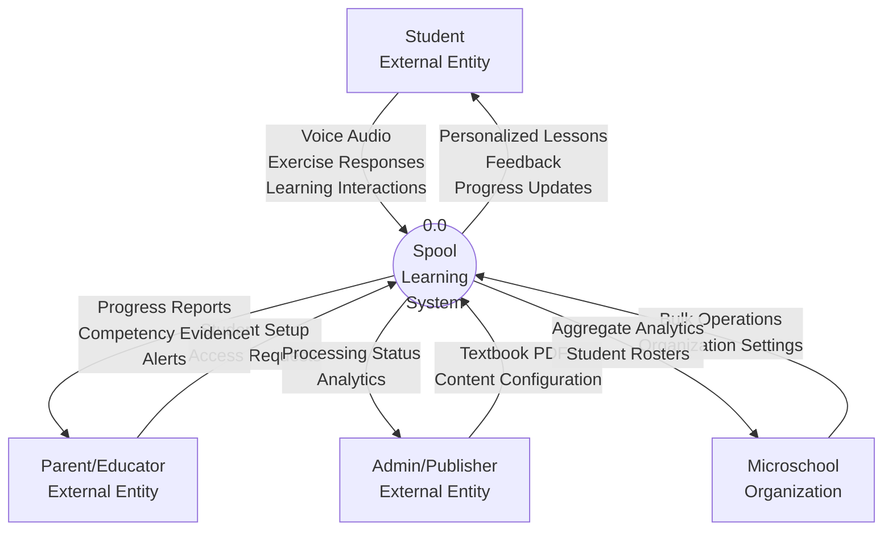
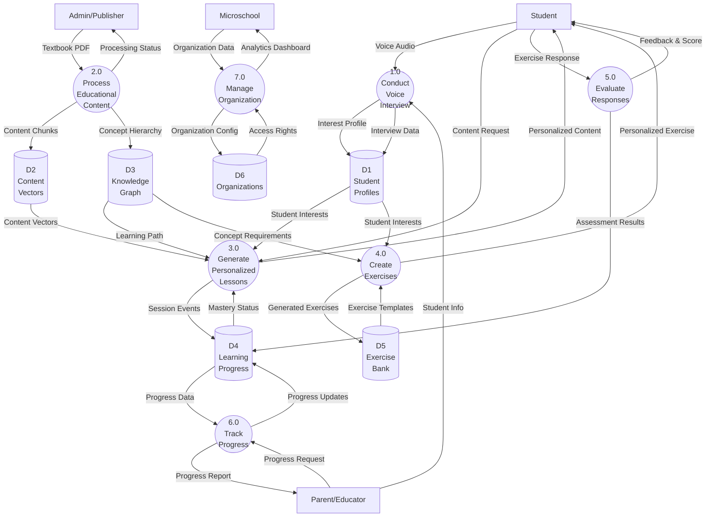
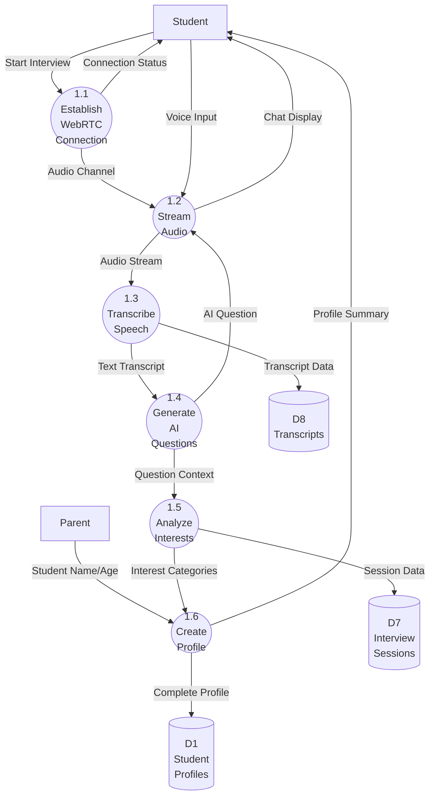
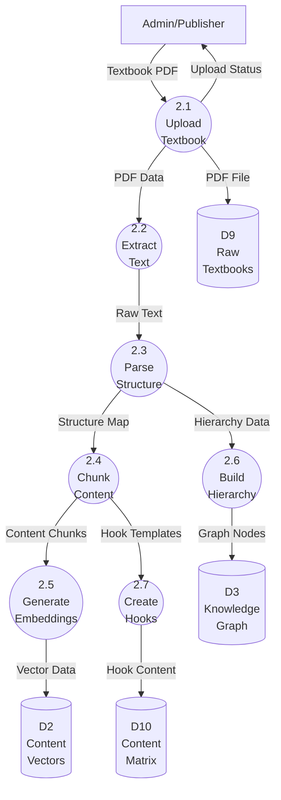
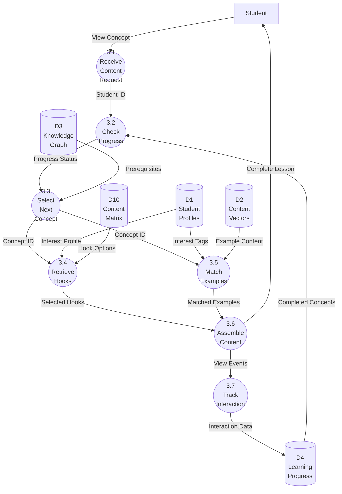
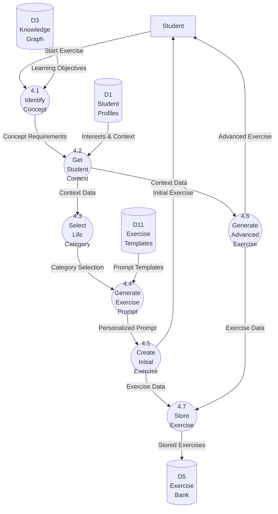
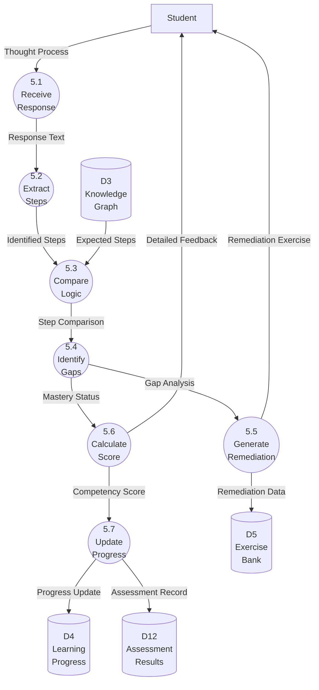
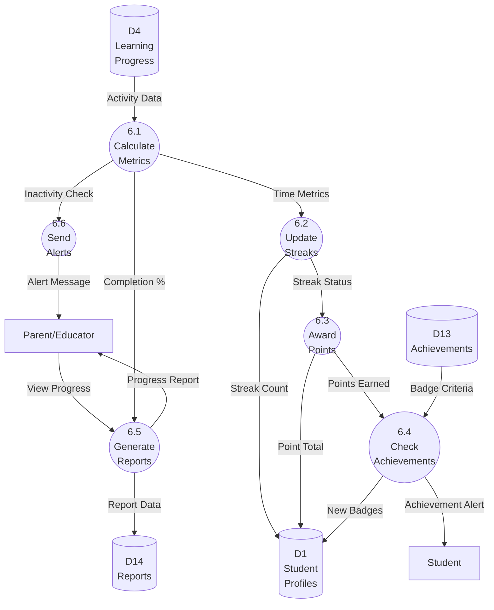
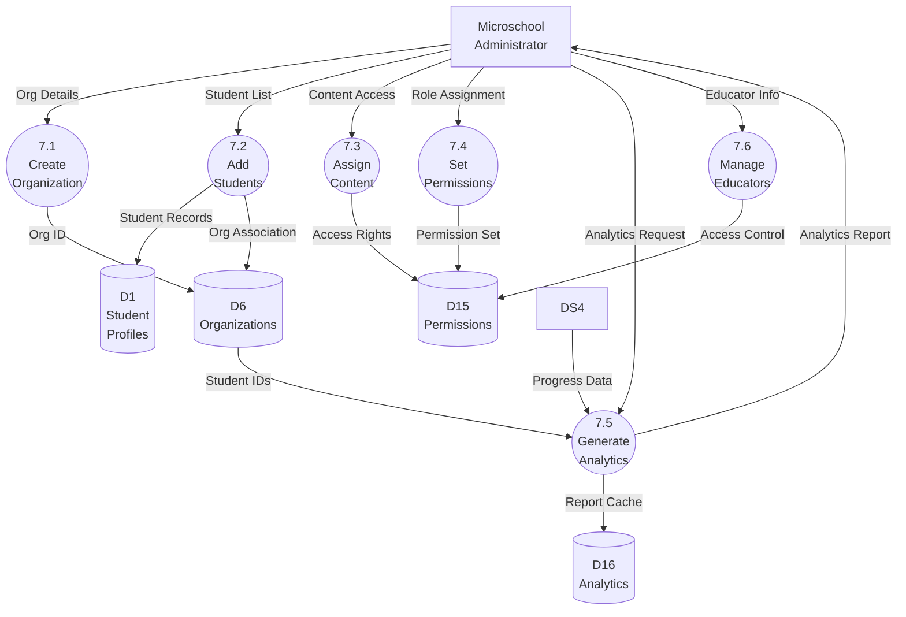

# Spool - Data Flow Diagram

## 1. Introduction

This Data Flow Diagram (DFD) illustrates how data moves through the Spool personalized learning management system. The diagram shows the flow of educational content from textbooks through AI processing to personalized student experiences, as well as the complete data lifecycle from student onboarding through mastery achievement. This document uses the Gane & Sarson notation to represent the system's data flows, processes, data stores, and external entities.

## 2. Key Components (Gane & Sarson Notation)

| Symbol | Name | Description | Spool Examples |
| :---- | :---- | :---- | :---- |
| Rectangle | **External Entity** | People or systems outside Spool that provide or receive data | Student, Parent, Educator, Admin, Publisher |
| Circle | **Process** | Activities that transform data | Voice Interview, Generate Exercise, Evaluate Response |
| Open Rectangle | **Data Store** | Where data is held for later use | Student Profiles, Content Vectors, Learning Progress |
| Arrow | **Data Flow** | Movement of data between components | Interview Audio, Personalized Content, Progress Report |

## 3. Context Diagram (Level 0)

## 4. Level 1 Data Flow Diagram

## 5. Level 2 DFD - Process 1.0: Conduct Voice Interview

### Data Elements:
- **Audio Stream**: 16kHz mono PCM audio
- **Text Transcript**: UTF-8 text with timestamps
- **Interest Categories**: JSON array with personal, social, career, philanthropic classifications
- **Complete Profile**: Student name, age, 5+ interests with categories and strength scores

## 6. Level 2 DFD - Process 2.0: Process Educational Content

### Content Processing Data:
- **Structure Map**: Subject→Topic→Section→Concept hierarchy
- **Content Chunks**: 500-1000 character segments with metadata
- **Vector Data**: 1536-dimensional embeddings with concept tags
- **Hook Content**: 4 life-category hooks per concept

## 7. Level 2 DFD - Process 3.0: Generate Personalized Lessons

### Personalization Logic:
- **Hook Selection**: Career and philanthropic hooks matched to primary interests
- **Example Matching**: Top 3-4 examples based on interest tag overlap
- **Content Assembly**: Hooks → Examples → Core Explanation in fixed order

## 8. Level 2 DFD - Process 4.0: Create Exercises

### Exercise Generation Data:
- **Life Category**: One of personal, social, career, philanthropic
- **Personalized Prompt**: Template + student interests + concept requirements
- **Exercise Levels**: Initial (basic application) and Advanced (complex synthesis)

## 9. Level 2 DFD - Process 5.0: Evaluate Responses

### Evaluation Data:
- **Identified Steps**: Array of logical steps extracted from response
- **Step Comparison**: Correct, missing, or incorrect classification for each step
- **Competency Score**: 0.0-1.0 based on step accuracy
- **Remediation Exercise**: Targeted exercise for first incorrect step

## 10. Level 2 DFD - Process 6.0: Track Progress

### Progress Tracking Data:
- **Completion %**: (mastered_concepts / total_concepts) * 100
- **Streak Count**: Consecutive days with learning activity
- **Points**: 10 for initial exercise, 15 for advanced exercise
- **Achievement Criteria**: JSON rules for badge awards

## 11. Level 2 DFD - Process 7.0: Manage Organization

## 12. Data Dictionary

### External Entity Data

| Data Element | Description | Format | Size |
|--------------|-------------|---------|------|
| Voice Audio | Student's spoken responses during interview | 16kHz PCM mono | ~1MB/min |
| Exercise Response | Student's written thought process | UTF-8 text | 50-2000 chars |
| Textbook PDF | Educational content from publishers | PDF binary | 10-500MB |
| Student Info | Name, birthday, parent contact | JSON | <1KB |
| Progress Request | Query for specific student/date range | HTTP GET params | <100 bytes |

### Process Data

| Data Element | Description | Format | Example |
|--------------|-------------|---------|---------|
| Interest Profile | Categorized student interests | JSON array | `[{"interest": "gaming", "category": "personal", "strength": 0.9}]` |
| Content Chunk | Segmented textbook content | JSON | `{"text": "...", "concept_id": "math_iteration_001", "type": "explanation"}` |
| Vector Embedding | Semantic representation | Float array[1536] | `[0.021, -0.134, ...]` |
| Personalized Exercise | Context-aware problem | JSON | `{"prompt": "Your gaming clan needs to calculate...", "expected_steps": [...]}` |
| Competency Score | Mastery evaluation | Float 0.0-1.0 | `0.85` |

### Data Store Contents

| Data Store | Key Elements | Update Frequency |
|------------|--------------|------------------|
| D1: Student Profiles | Name, interests, badges, points | Real-time |
| D2: Content Vectors | Embeddings, metadata, concept IDs | On content upload |
| D3: Knowledge Graph | Concept hierarchy, prerequisites | On content upload |
| D4: Learning Progress | Mastery status, time spent, attempts | After each interaction |
| D5: Exercise Bank | Generated exercises, remediation | As created |
| D6: Organizations | Settings, student associations | On admin changes |

## 13. Data Flow Rules

1. **Privacy Rule**: Voice audio is processed in real-time and never stored permanently
2. **Prerequisite Rule**: Students cannot access concepts without completing prerequisites
3. **Personalization Rule**: All content requests must include student profile for customization
4. **Mastery Rule**: Concepts require both initial and advanced exercise completion
5. **Consistency Rule**: Progress updates are atomic transactions to prevent partial states
6. **Access Rule**: All data access is filtered by organization permissions

## 14. Key Design Decisions

1. **Real-time Processing**: Voice interviews use streaming to avoid audio storage
2. **Vector-based Retrieval**: Content matching uses semantic similarity for flexibility
3. **Graph-based Prerequisites**: Neo4j enables complex learning path relationships
4. **Step-wise Evaluation**: Exercise responses are decomposed for precise feedback
5. **Event-driven Analytics**: All interactions generate events for comprehensive tracking

This comprehensive DFD provides a complete view of how data flows through the Spool system, from initial student onboarding through content personalization and mastery achievement. Each process is decomposed to show the specific transformations and data stores involved in delivering personalized education.