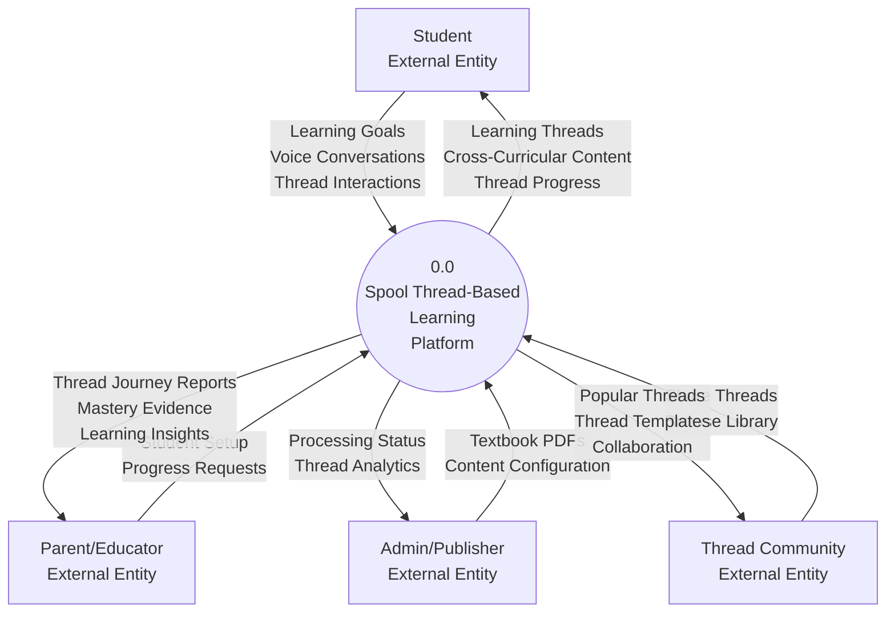
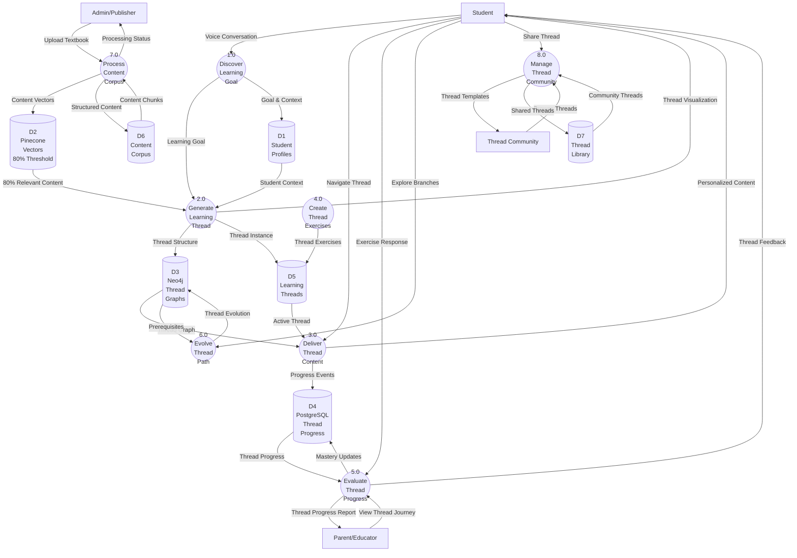
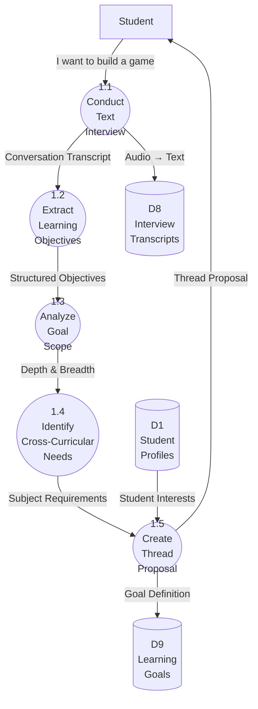
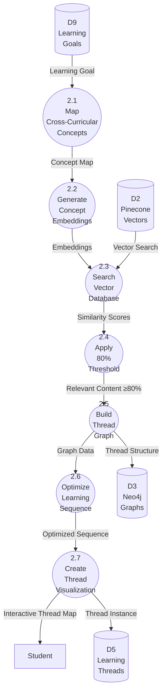
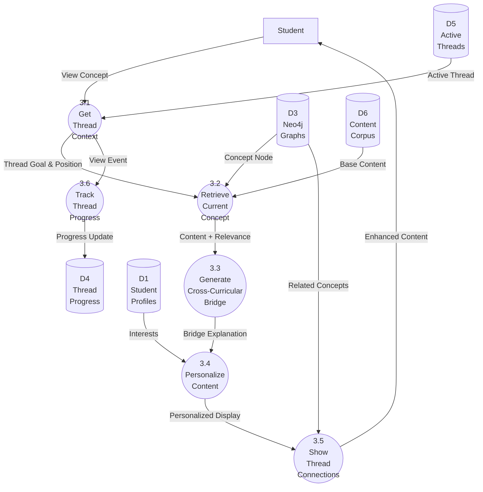
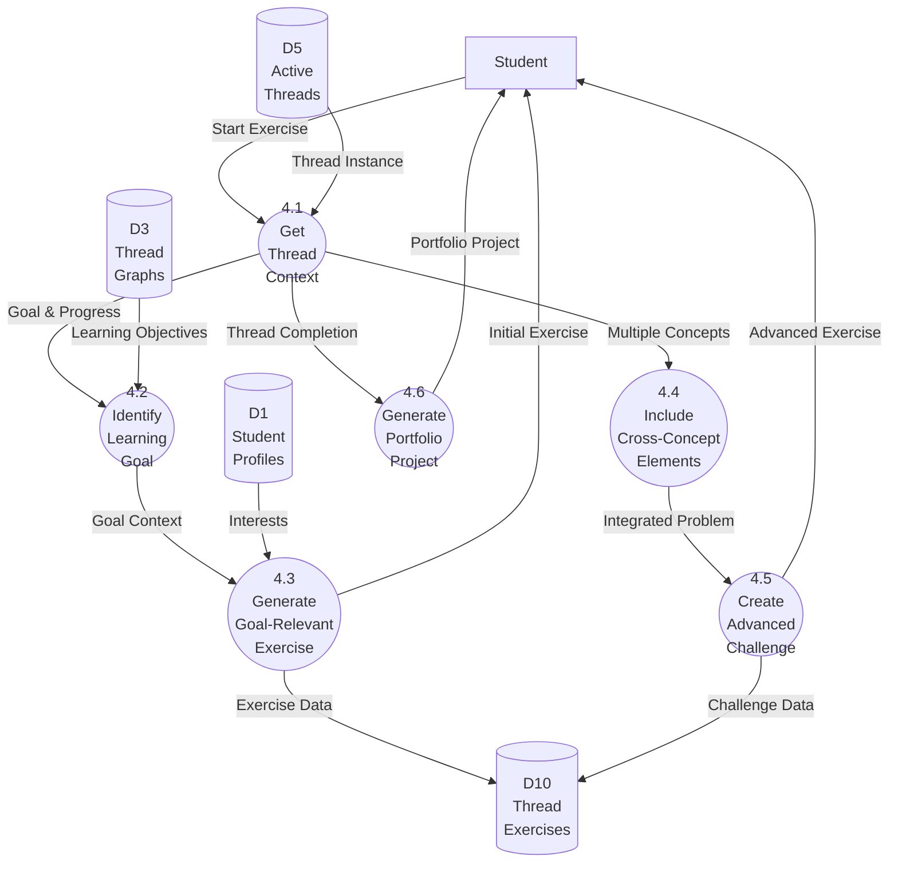
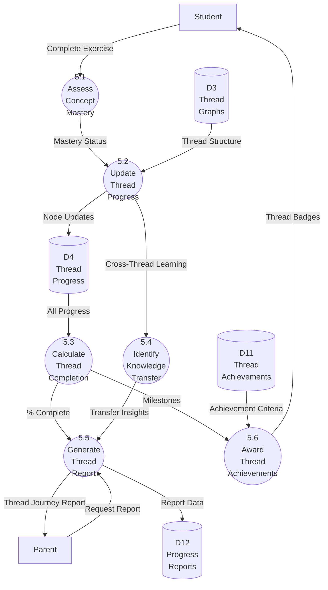
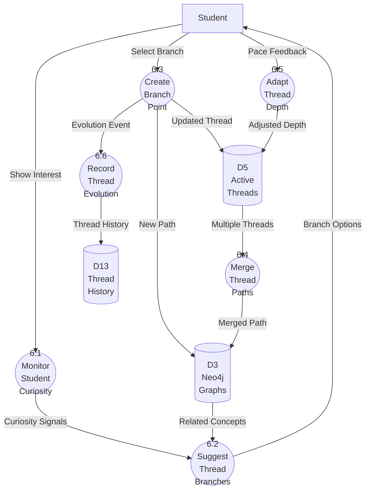
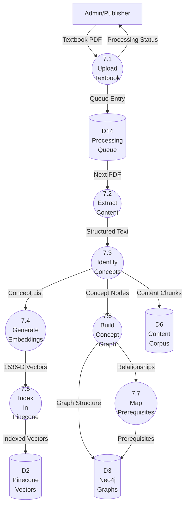
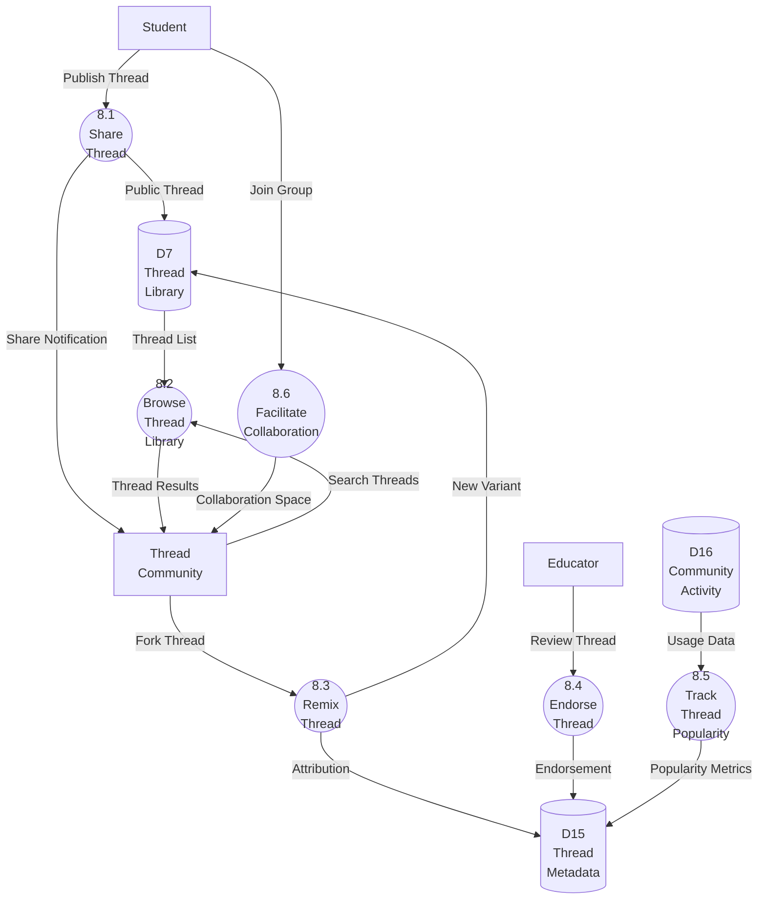

# Spool - Thread-Based Learning Data Flow Diagram (Supabase Architecture)

## 1. Introduction

This Data Flow Diagram (DFD) illustrates how data moves through the Spool Thread-based learning platform built on Supabase infrastructure. The diagram shows the revolutionary flow where students articulate learning goals through conversation, and the system dynamically assembles personalized Learning Threads by connecting relevant academic concepts from across all subjects. This document uses the Gane & Sarson notation to represent the system's data flows, processes, data stores, and external entities, with special emphasis on cross-curricular content discovery, the 80% relevance threshold that ensures quality, and Supabase Edge Functions that power all processing.

## 2. Key Components (Gane & Sarson Notation)

| Symbol | Name | Description | Spool Thread Examples |
| :---- | :---- | :---- | :---- |
| Rectangle | **External Entity** | People or systems outside Spool | Student, Parent, Educator, Thread Community |
| Circle | **Process** | Activities that transform data | Generate Thread, Map Concepts, Calculate Relevance |
| Open Rectangle | **Data Store** | Where data is held | Thread Graphs, Content Vectors, Learning Threads |
| Arrow | **Data Flow** | Movement of data | Learning Goal, Thread Visualization, Relevance Scores |

## 3. Context Diagram (Level 0) - Thread-Based Learning System



## 4. Level 1 Data Flow Diagram - Thread Architecture



## 5. Level 2 DFD - Process 1.0: Discover Learning Goal



### Learning Goal Discovery Data:
- **Conversation Topics**: "What are you curious about?", "What would you like to create?"
- **Learning Objectives**: Structured goals extracted by LLM
- **Subject Requirements**: Initial mapping of needed subjects
- **Thread Proposal**: Preliminary Thread concept with estimated scope

## 6. Level 2 DFD - Process 2.0: Generate Learning Thread



### Thread Generation Data:
- **Concept Map**: All concepts across subjects relevant to goal
- **Embeddings**: 1536-dimensional vectors for semantic search
- **Relevance Scores**: 0-100% similarity to learning goal
- **80% Threshold**: Only content ≥80% relevance included
- **Thread Graph**: Nodes (concepts) + Edges (relationships/prerequisites)

## 7. Level 2 DFD - Process 3.0: Deliver Thread Content



### Thread Content Elements:
- **Thread Context**: Current position in Thread, overall goal
- **Bridge Explanation**: Why this concept matters for the Thread
- **Cross-Curricular Connections**: Links to concepts from other subjects
- **Relevance Display**: Shows 80-100% relevance score
- **Progress Indicators**: Completed, current, upcoming concepts

## 8. Level 2 DFD - Process 4.0: Create Thread Exercises



### Thread Exercise Features:
- **Goal Integration**: Every exercise relates to Thread's learning goal
- **Cross-Concept Problems**: Exercises combining multiple Thread concepts
- **Thread Context**: "In your game development journey..."
- **Portfolio Projects**: Culminating demonstrations of Thread mastery

## 9. Level 2 DFD - Process 5.0: Evaluate Thread Progress



### Thread Progress Metrics:
- **Thread Completion**: % of Thread concepts mastered
- **Cross-Curricular Connections**: Subjects successfully integrated
- **Knowledge Transfer**: Concepts applied across Threads
- **Thread Achievements**: "Game Dev Thread Master", "Climate Explorer"

## 10. Level 2 DFD - Process 6.0: Evolve Thread Path



### Thread Evolution Features:
- **Branch Points**: Opportunities to explore related topics
- **Thread Merging**: When paths converge on similar concepts
- **Depth Adaptation**: Adjusting complexity based on engagement
- **Evolution History**: Complete record of Thread journey

## 11. Level 2 DFD - Process 7.0: Process Content Corpus



### Content Processing for Threads:
- **Concept Extraction**: Identifying discrete learnable units
- **Embedding Generation**: OpenAI text-embedding-ada-002
- **Vector Indexing**: Pinecone with subject/topic metadata
- **Graph Building**: Neo4j nodes for cross-curricular mapping
- **Prerequisite Mapping**: Both within and across subjects

## 12. Level 2 DFD - Process 8.0: Manage Thread Community



## 13. Thread-Specific Data Dictionary

### Thread Data Elements

| Data Element | Description | Format | Example |
|--------------|-------------|---------|---------|
| Learning Goal | Student's articulated curiosity | Text | "I want to build my own video game" |
| Thread ID | Unique Thread identifier | UUID | "thread_2025_game_dev_001" |
| Concept Relevance | Similarity to learning goal | Float 0-1 | 0.87 (87% relevant) |
| Thread Graph | Neo4j representation | Cypher | `(t:Thread)-[:CONTAINS]->(c:Concept)` |
| Cross-Curricular Bridge | Explanation of connection | Text | "Physics helps with realistic game movement" |
| Thread Progress | Completion state | JSON | `{"completed": 15, "total": 42, "current": "physics_vectors"}` |

### Pinecone Vector Data

| Field | Description | Type | Constraints |
|-------|-------------|------|-------------|
| vector_id | Unique identifier | String | concept_{subject}_{topic}_{id} |
| values | Embedding vector | Float[1536] | Normalized |
| metadata.subject | Academic subject | String | One of 8 subjects |
| metadata.relevance_score | Thread relevance | Float | Must be ≥0.80 for inclusion |
| metadata.prerequisites | Required concepts | Array | Concept IDs |

### Neo4j Graph Schema

```cypher
// Thread Node
(t:Thread {
    id: String,
    goal: String,
    user_id: String,
    created: DateTime,
    status: String // 'active', 'completed', 'branched'
})

// Concept Node  
(c:Concept {
    id: String,
    name: String,
    subject: String,
    difficulty: String
})

// Thread Contains Concept
(t)-[:CONTAINS {
    sequence: Integer,
    relevance: Float, // 0.80-1.00
    status: String // 'pending', 'current', 'completed'
}]->(c)

// Cross-Curricular Bridge
(c1)-[:BRIDGES_TO {
    thread_id: String,
    explanation: String,
    strength: Float
}]->(c2)
```

## 14. Critical Data Flow Rules

### Thread Generation Rules
1. **80% Threshold Rule**: Only content with ≥80% relevance to learning goal included
2. **Cross-Curricular Rule**: Every Thread must span at least 2 subjects
3. **Sequence Rule**: Prerequisites must be completed before dependent concepts
4. **Branch Rule**: Students can explore branches without abandoning main Thread

### Content Delivery Rules
1. **Context Rule**: Every concept must show Thread goal relevance
2. **Bridge Rule**: Cross-subject transitions require explicit explanations
3. **Progress Rule**: Thread visualization updates in real-time
4. **Transfer Rule**: Completed concepts available across all user's Threads

### Community Rules
1. **Attribution Rule**: Remixed Threads maintain original creator credit
2. **Privacy Rule**: Students control Thread sharing permissions
3. **Quality Rule**: Only educator-endorsed Threads featured
4. **Collaboration Rule**: Thread groups limited to 20 students

## 15. Performance Constraints

### Vector Search Performance
- **Pinecone Query**: <100ms for 10 concepts
- **Relevance Calculation**: Real-time during search
- **Result Set**: Maximum 1000 vectors per query
- **Batch Processing**: 100 concepts per Thread generation

### Graph Traversal Performance  
- **Neo4j Query**: <50ms for Thread path
- **Prerequisite Check**: <20ms per concept
- **Branch Discovery**: <100ms for 5 options
- **Thread Merge**: <200ms for convergence check

## 16. Thread-Based Architecture Benefits

1. **Curiosity-Driven**: Learning paths follow student interests
2. **Cross-Curricular**: Natural integration across subjects
3. **Quality Assured**: 80% threshold ensures relevance
4. **Dynamic**: Threads evolve with student exploration
5. **Community**: Shared learning journeys inspire others
6. **Measurable**: Clear progress through Thread completion

This Thread-based data flow architecture transforms education from rigid subject silos into dynamic, interconnected learning journeys where student curiosity truly drives the curriculum.