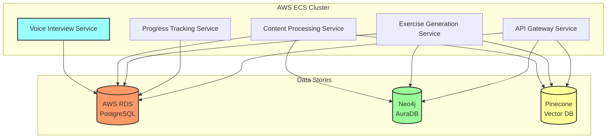

# Spool - Entity Relationship Diagram

## Overview
This ERD defines the complete database schema for Spool's personalized learning management system based on the comprehensive data flow and functional requirements. The design separates data across three storage systems:
- **AWS RDS PostgreSQL**: Transactional data, user management, progress tracking, and system operations
- **Neo4j AuraDB**: Educational content hierarchy, learning paths, and concept relationships
- **Pinecone**: Vector embeddings for semantic content retrieval and personalization

All databases communicate with AWS ECS services running the application containers.

## Infrastructure Architecture



## User Management Tables (AWS RDS PostgreSQL)

### 1. **users**
Core user authentication and account management.
```sql
CREATE TABLE users (
    id UUID PRIMARY KEY DEFAULT gen_random_uuid(),
    email VARCHAR(255) UNIQUE NOT NULL,
    auth_provider VARCHAR(50) DEFAULT 'email', -- 'email', 'google', 'microsoft'
    auth_id VARCHAR(255) UNIQUE,
    cognito_sub VARCHAR(255) UNIQUE, -- AWS Cognito subject identifier
    is_active BOOLEAN DEFAULT TRUE,
    email_verified BOOLEAN DEFAULT FALSE,
    last_login_at TIMESTAMPTZ,
    failed_login_attempts INTEGER DEFAULT 0,
    locked_until TIMESTAMPTZ,
    created_at TIMESTAMPTZ DEFAULT NOW(),
    updated_at TIMESTAMPTZ DEFAULT NOW()
);

CREATE INDEX idx_users_email ON users(email);
CREATE INDEX idx_users_cognito_sub ON users(cognito_sub);
CREATE INDEX idx_users_last_login ON users(last_login_at);
```

### 2. **organizations**
Microschools and educational institutions.
```sql
CREATE TABLE organizations (
    id UUID PRIMARY KEY DEFAULT gen_random_uuid(),
    name VARCHAR(255) NOT NULL,
    type VARCHAR(50) NOT NULL, -- 'microschool', 'homeschool_group', 'tutoring_center'
    subscription_tier VARCHAR(50) DEFAULT 'starter', -- 'starter', 'professional', 'enterprise'
    max_students INTEGER NOT NULL,
    current_students INTEGER DEFAULT 0,
    billing_email VARCHAR(255),
    settings JSONB DEFAULT '{}', -- Customizable org settings
    is_active BOOLEAN DEFAULT TRUE,
    trial_ends_at TIMESTAMPTZ,
    created_at TIMESTAMPTZ DEFAULT NOW(),
    updated_at TIMESTAMPTZ DEFAULT NOW()
);

CREATE INDEX idx_organizations_type ON organizations(type);
CREATE INDEX idx_organizations_active ON organizations(is_active);
```

### 3. **organization_members**
Links users to organizations with roles.
```sql
CREATE TABLE organization_members (
    organization_id UUID REFERENCES organizations(id) ON DELETE CASCADE,
    user_id UUID REFERENCES users(id) ON DELETE CASCADE,
    role VARCHAR(50) NOT NULL, -- 'admin', 'educator', 'student', 'parent'
    permissions JSONB DEFAULT '{}', -- Granular permissions
    invited_by UUID REFERENCES users(id),
    joined_at TIMESTAMPTZ DEFAULT NOW(),
    PRIMARY KEY (organization_id, user_id)
);

CREATE INDEX idx_org_members_user ON organization_members(user_id);
CREATE INDEX idx_org_members_role ON organization_members(role);
```

## Student Profile Tables (PostgreSQL)

### 4. **student_profiles**
Detailed student information and learning preferences from voice interview.
```sql
CREATE TABLE student_profiles (
    id UUID PRIMARY KEY DEFAULT gen_random_uuid(),
    user_id UUID REFERENCES users(id) ON DELETE CASCADE,
    organization_id UUID REFERENCES organizations(id) ON DELETE SET NULL,
    
    -- Basic Info
    first_name VARCHAR(100) NOT NULL,
    last_name VARCHAR(100) NOT NULL,
    preferred_name VARCHAR(100),
    birthday DATE,
    grade_level VARCHAR(20),
    
    -- Interest Discovery Results from Voice Interview
    interests JSONB NOT NULL DEFAULT '[]', -- Array of {interest, category, strength}
    career_interests JSONB DEFAULT '[]', -- Primary career interests
    philanthropic_interests JSONB DEFAULT '[]', -- Cause interests
    learning_style_indicators JSONB DEFAULT '{}',
    
    -- Life Categories Preferences
    life_category_weights JSONB DEFAULT '{"personal": 0.25, "social": 0.25, "career": 0.25, "philanthropic": 0.25}',
    
    -- Gamification
    total_points INTEGER DEFAULT 0,
    current_streak_days INTEGER DEFAULT 0,
    longest_streak_days INTEGER DEFAULT 0,
    last_activity_date DATE,
    badges_earned JSONB DEFAULT '[]',
    level INTEGER DEFAULT 1,
    experience_points INTEGER DEFAULT 0,
    
    -- Settings
    preferred_session_length INTEGER DEFAULT 45, -- minutes
    daily_goal_minutes INTEGER DEFAULT 30,
    notification_preferences JSONB DEFAULT '{}',
    
    created_at TIMESTAMPTZ DEFAULT NOW(),
    updated_at TIMESTAMPTZ DEFAULT NOW()
);

CREATE INDEX idx_student_profiles_user ON student_profiles(user_id);
CREATE INDEX idx_student_profiles_org ON student_profiles(organization_id);
CREATE INDEX idx_student_profiles_streak ON student_profiles(current_streak_days);
```

### 5. **interview_sessions**
Voice interview data and processing.
```sql
CREATE TABLE interview_sessions (
    id UUID PRIMARY KEY DEFAULT gen_random_uuid(),
    student_profile_id UUID REFERENCES student_profiles(id) ON DELETE CASCADE,
    status VARCHAR(50) DEFAULT 'in_progress', -- 'in_progress', 'completed', 'abandoned', 'failed'
    interview_type VARCHAR(50) DEFAULT 'initial', -- 'initial', 'update', 'supplemental'
    
    -- WebRTC Session Data
    webrtc_session_id VARCHAR(255),
    connection_quality VARCHAR(20), -- 'excellent', 'good', 'poor'
    
    -- Interview Data
    questions JSONB NOT NULL, -- Array of {question_id, question_text, order}
    responses JSONB DEFAULT '[]', -- Array of {question_id, audio_url, transcript, timestamp}
    
    -- Timing
    started_at TIMESTAMPTZ DEFAULT NOW(),
    completed_at TIMESTAMPTZ,
    duration_seconds INTEGER,
    total_speaking_time INTEGER, -- seconds student spoke
    
    -- Analysis Results
    extracted_interests JSONB, -- Processed interests with categories
    confidence_scores JSONB, -- Confidence in each extraction
    ai_notes TEXT, -- Additional observations from AI
    
    -- Technical Metadata
    browser_info JSONB,
    connection_logs JSONB DEFAULT '[]',
    
    created_at TIMESTAMPTZ DEFAULT NOW()
);

CREATE INDEX idx_interview_student ON interview_sessions(student_profile_id);
CREATE INDEX idx_interview_status ON interview_sessions(status);
CREATE INDEX idx_interview_date ON interview_sessions(started_at);
```

## Content Management Tables (PostgreSQL)

### 6. **textbooks**
Registry of available textbooks with processing status.
```sql
CREATE TABLE textbooks (
    id UUID PRIMARY KEY DEFAULT gen_random_uuid(),
    title VARCHAR(255) NOT NULL,
    subject VARCHAR(50) NOT NULL, -- 'Math', 'Literature', 'Humanities', 'Science', etc.
    publisher VARCHAR(100),
    isbn VARCHAR(20),
    year INTEGER,
    grade_levels VARCHAR(50)[], -- Array of applicable grades
    
    -- Processing Status
    s3_path VARCHAR(500) NOT NULL,
    file_size_mb INTEGER,
    page_count INTEGER,
    is_processed BOOLEAN DEFAULT FALSE,
    processing_status VARCHAR(50) DEFAULT 'pending', -- 'pending', 'processing', 'completed', 'failed'
    processed_at TIMESTAMPTZ,
    processing_error TEXT,
    processing_metadata JSONB, -- Stats about extraction
    
    -- Content Metadata
    total_concepts INTEGER,
    total_sections INTEGER,
    estimated_hours INTEGER,
    difficulty_range VARCHAR(20), -- 'beginner', 'intermediate', 'advanced'
    
    -- Access Control
    is_active BOOLEAN DEFAULT TRUE,
    requires_license BOOLEAN DEFAULT FALSE,
    
    created_at TIMESTAMPTZ DEFAULT NOW(),
    updated_at TIMESTAMPTZ DEFAULT NOW()
);

CREATE INDEX idx_textbooks_subject ON textbooks(subject);
CREATE INDEX idx_textbooks_processed ON textbooks(is_processed);
CREATE INDEX idx_textbooks_active ON textbooks(is_active);
```

### 7. **content_hooks**
Pre-written hooks for each concept across life categories.
```sql
CREATE TABLE content_hooks (
    id UUID PRIMARY KEY DEFAULT gen_random_uuid(),
    concept_id VARCHAR(255) NOT NULL, -- References Neo4j concept
    life_category VARCHAR(50) NOT NULL, -- 'personal', 'social', 'career', 'philanthropic'
    sub_category VARCHAR(100), -- For career: 'technology', 'business', etc.
    
    -- Hook Content
    hook_text TEXT NOT NULL,
    hook_type VARCHAR(50) DEFAULT 'standard', -- 'standard', 'advanced', 'simplified'
    
    -- Metadata
    author_id UUID REFERENCES users(id),
    is_active BOOLEAN DEFAULT TRUE,
    usage_count INTEGER DEFAULT 0,
    effectiveness_score DECIMAL(3,2), -- 0.00 to 1.00 based on engagement
    
    created_at TIMESTAMPTZ DEFAULT NOW(),
    updated_at TIMESTAMPTZ DEFAULT NOW()
);

CREATE INDEX idx_hooks_concept ON content_hooks(concept_id);
CREATE INDEX idx_hooks_category ON content_hooks(life_category, sub_category);
CREATE INDEX idx_hooks_active ON content_hooks(is_active);
```

### 8. **content_examples**
Interest-tagged examples for concepts.
```sql
CREATE TABLE content_examples (
    id UUID PRIMARY KEY DEFAULT gen_random_uuid(),
    concept_id VARCHAR(255) NOT NULL, -- References Neo4j concept
    
    -- Example Content
    example_text TEXT NOT NULL,
    visual_aid_url VARCHAR(500),
    interactive_element JSONB, -- Definition of any interactive component
    
    -- Interest Tagging
    interest_tags VARCHAR(50)[] NOT NULL, -- ['gaming', 'music', 'sports']
    life_category VARCHAR(50) NOT NULL,
    difficulty_level VARCHAR(20) NOT NULL, -- 'basic', 'intermediate', 'advanced'
    
    -- Metadata
    author_id UUID REFERENCES users(id),
    is_active BOOLEAN DEFAULT TRUE,
    usage_count INTEGER DEFAULT 0,
    effectiveness_score DECIMAL(3,2),
    
    created_at TIMESTAMPTZ DEFAULT NOW(),
    updated_at TIMESTAMPTZ DEFAULT NOW()
);

CREATE INDEX idx_examples_concept ON content_examples(concept_id);
CREATE INDEX idx_examples_tags ON content_examples USING GIN(interest_tags);
CREATE INDEX idx_examples_difficulty ON content_examples(difficulty_level);
```

## Learning Progress Tables (PostgreSQL)

### 9. **learning_paths**
Student's active learning paths by subject.
```sql
CREATE TABLE learning_paths (
    id UUID PRIMARY KEY DEFAULT gen_random_uuid(),
    student_profile_id UUID REFERENCES student_profiles(id) ON DELETE CASCADE,
    textbook_id UUID REFERENCES textbooks(id) ON DELETE CASCADE,
    subject VARCHAR(100) NOT NULL,
    
    -- Progress Tracking
    current_topic_id VARCHAR(255), -- References Neo4j topic
    current_section_id VARCHAR(255), -- References Neo4j section
    current_concept_id VARCHAR(255), -- References Neo4j concept
    
    -- Navigation State
    next_concept_id VARCHAR(255),
    available_concepts VARCHAR(255)[], -- Based on prerequisites
    
    -- Metrics
    concepts_completed INTEGER DEFAULT 0,
    concepts_total INTEGER DEFAULT 0,
    concepts_mastered INTEGER DEFAULT 0,
    average_mastery_score DECIMAL(3,2),
    
    -- Pacing
    estimated_completion_date DATE,
    daily_target_minutes INTEGER DEFAULT 30,
    
    -- Status
    status VARCHAR(50) DEFAULT 'active', -- 'active', 'paused', 'completed', 'abandoned'
    started_at TIMESTAMPTZ DEFAULT NOW(),
    last_accessed_at TIMESTAMPTZ DEFAULT NOW(),
    completed_at TIMESTAMPTZ,
    
    CONSTRAINT unique_student_subject UNIQUE(student_profile_id, subject)
);

CREATE INDEX idx_paths_student ON learning_paths(student_profile_id);
CREATE INDEX idx_paths_status ON learning_paths(status);
CREATE INDEX idx_paths_last_accessed ON learning_paths(last_accessed_at);
```

### 10. **concept_progress**
Detailed progress tracking for each concept.
```sql
CREATE TABLE concept_progress (
    id UUID PRIMARY KEY DEFAULT gen_random_uuid(),
    student_profile_id UUID REFERENCES student_profiles(id) ON DELETE CASCADE,
    learning_path_id UUID REFERENCES learning_paths(id) ON DELETE CASCADE,
    
    -- Concept Reference (from Neo4j)
    concept_id VARCHAR(255) NOT NULL,
    concept_name VARCHAR(255) NOT NULL,
    
    -- Progress Status
    status VARCHAR(50) DEFAULT 'not_started', -- 'not_started', 'viewing', 'practicing', 'completed', 'mastered'
    
    -- Component Progress
    hook_viewed BOOLEAN DEFAULT FALSE,
    examples_viewed INTEGER DEFAULT 0,
    core_content_viewed BOOLEAN DEFAULT FALSE,
    initial_exercise_status VARCHAR(50), -- 'not_started', 'in_progress', 'completed'
    advanced_exercise_status VARCHAR(50), -- 'not_started', 'in_progress', 'completed'
    
    -- Scoring
    initial_exercise_score DECIMAL(3,2), -- 0.00 to 1.00
    advanced_exercise_score DECIMAL(3,2), -- 0.00 to 1.00
    final_mastery_score DECIMAL(3,2), -- 0.00 to 1.00
    
    -- Remediation Tracking
    remediation_count INTEGER DEFAULT 0,
    remediation_concepts VARCHAR(255)[], -- Concepts covered in remediation
    
    -- Timing
    started_at TIMESTAMPTZ,
    completed_at TIMESTAMPTZ,
    mastered_at TIMESTAMPTZ,
    total_time_seconds INTEGER DEFAULT 0,
    active_time_seconds INTEGER DEFAULT 0, -- Excluding idle time
    
    -- Attempt Tracking
    attempt_count INTEGER DEFAULT 0,
    last_attempt_at TIMESTAMPTZ,
    
    created_at TIMESTAMPTZ DEFAULT NOW(),
    updated_at TIMESTAMPTZ DEFAULT NOW(),
    
    CONSTRAINT unique_student_concept UNIQUE(student_profile_id, concept_id)
);

CREATE INDEX idx_concept_progress_student ON concept_progress(student_profile_id);
CREATE INDEX idx_concept_progress_status ON concept_progress(status);
CREATE INDEX idx_concept_progress_mastery ON concept_progress(final_mastery_score);
```

### 11. **learning_sessions**
Tracks individual learning sessions with detailed interactions.
```sql
CREATE TABLE learning_sessions (
    id UUID PRIMARY KEY DEFAULT gen_random_uuid(),
    student_profile_id UUID REFERENCES student_profiles(id) ON DELETE CASCADE,
    learning_path_id UUID REFERENCES learning_paths(id) ON DELETE CASCADE,
    
    -- Session Details
    concept_id VARCHAR(255) NOT NULL,
    session_type VARCHAR(50) NOT NULL, -- 'lesson', 'exercise', 'assessment', 'review'
    session_number INTEGER NOT NULL, -- Sequential number for this concept
    
    -- Content Delivered
    personalized_content JSONB NOT NULL, -- Complete generated content
    selected_hooks JSONB, -- Which hooks were shown
    selected_examples JSONB, -- Which examples were shown
    life_category VARCHAR(50), -- Primary category for this session
    
    -- Timing
    started_at TIMESTAMPTZ DEFAULT NOW(),
    ended_at TIMESTAMPTZ,
    duration_seconds INTEGER,
    active_seconds INTEGER, -- Time with actual interaction
    idle_periods JSONB DEFAULT '[]', -- Array of idle period timestamps
    
    -- Engagement Metrics
    interactions JSONB DEFAULT '[]', -- Array of {type, timestamp, element, duration}
    scroll_depth_percent INTEGER,
    component_engagement JSONB, -- Time spent on each component
    
    -- Device/Context
    device_type VARCHAR(50), -- 'desktop', 'tablet', 'mobile'
    browser_info JSONB,
    
    created_at TIMESTAMPTZ DEFAULT NOW()
);

CREATE INDEX idx_sessions_student ON learning_sessions(student_profile_id);
CREATE INDEX idx_sessions_date ON learning_sessions(started_at);
CREATE INDEX idx_sessions_concept ON learning_sessions(concept_id);
CREATE INDEX idx_sessions_type ON learning_sessions(session_type);
```

## Assessment Tables (PostgreSQL)

### 12. **assessments**
Student assessment submissions with detailed evaluation.
```sql
CREATE TABLE assessments (
    id UUID PRIMARY KEY DEFAULT gen_random_uuid(),
    student_profile_id UUID REFERENCES student_profiles(id) ON DELETE CASCADE,
    concept_id VARCHAR(255) NOT NULL,
    learning_session_id UUID REFERENCES learning_sessions(id) ON DELETE SET NULL,
    
    -- Assessment Context
    assessment_type VARCHAR(50) NOT NULL, -- 'initial_exercise', 'advanced_exercise', 'remediation'
    exercise_level VARCHAR(20) NOT NULL, -- 'basic', 'intermediate', 'advanced'
    life_category VARCHAR(50) NOT NULL, -- Which category was used
    personalization_context JSONB, -- Interests used in generation
    
    -- Exercise Content
    exercise_prompt TEXT NOT NULL,
    expected_steps JSONB NOT NULL, -- Array of expected logical steps
    
    -- Student Response
    student_response TEXT NOT NULL,
    response_format VARCHAR(20), -- 'text', 'voice', 'mixed'
    
    -- Step-by-Step Evaluation
    identified_steps JSONB NOT NULL, -- Steps found in response
    step_evaluations JSONB NOT NULL, -- Array of {step, status, feedback}
    missing_steps JSONB DEFAULT '[]',
    incorrect_steps JSONB DEFAULT '[]',
    
    -- Scoring
    steps_correct INTEGER,
    steps_total INTEGER,
    competency_score DECIMAL(3,2), -- 0.00 to 1.00
    
    -- Detailed Evaluation
    conceptual_understanding DECIMAL(3,2),
    articulation_quality DECIMAL(3,2),
    application_ability DECIMAL(3,2),
    
    -- AI Feedback
    ai_feedback TEXT,
    remediation_needed BOOLEAN DEFAULT FALSE,
    remediation_focus VARCHAR(255), -- Specific area needing help
    
    -- Status
    status VARCHAR(50) DEFAULT 'completed', -- 'in_progress', 'completed', 'evaluated', 'abandoned'
    submitted_at TIMESTAMPTZ DEFAULT NOW(),
    evaluated_at TIMESTAMPTZ,
    time_taken_seconds INTEGER,
    
    created_at TIMESTAMPTZ DEFAULT NOW()
);

CREATE INDEX idx_assessments_student ON assessments(student_profile_id);
CREATE INDEX idx_assessments_concept ON assessments(concept_id);
CREATE INDEX idx_assessments_score ON assessments(competency_score);
CREATE INDEX idx_assessments_type ON assessments(assessment_type);
CREATE INDEX idx_assessments_remediation ON assessments(remediation_needed);
```

### 13. **exercise_generations**
Tracks all dynamically generated exercises.
```sql
CREATE TABLE exercise_generations (
    id UUID PRIMARY KEY DEFAULT gen_random_uuid(),
    learning_session_id UUID REFERENCES learning_sessions(id) ON DELETE CASCADE,
    assessment_id UUID REFERENCES assessments(id) ON DELETE SET NULL,
    concept_id VARCHAR(255) NOT NULL,
    
    -- Generation Context
    generation_type VARCHAR(50) NOT NULL, -- 'initial', 'advanced', 'remediation'
    target_step VARCHAR(255), -- For remediation exercises
    
    -- Personalization Input
    student_interests JSONB NOT NULL,
    life_category VARCHAR(50) NOT NULL,
    selected_interest VARCHAR(100), -- Primary interest used
    
    -- Prompt Construction
    base_template TEXT NOT NULL,
    personalization_prompt TEXT NOT NULL,
    final_prompt TEXT NOT NULL,
    
    -- Generated Content
    generated_exercise JSONB NOT NULL, -- Complete exercise with all parts
    expected_solution JSONB NOT NULL,
    expected_steps JSONB NOT NULL,
    
    -- Generation Metadata
    generation_model VARCHAR(50) DEFAULT 'gpt-4',
    generation_timestamp TIMESTAMPTZ DEFAULT NOW(),
    generation_time_ms INTEGER,
    token_count INTEGER,
    
    -- Quality Metrics
    difficulty_level VARCHAR(20), -- 'easy', 'medium', 'hard'
    relevance_score DECIMAL(3,2), -- How well it matches interests
    
    created_at TIMESTAMPTZ DEFAULT NOW()
);

CREATE INDEX idx_exercise_session ON exercise_generations(learning_session_id);
CREATE INDEX idx_exercise_concept ON exercise_generations(concept_id);
CREATE INDEX idx_exercise_type ON exercise_generations(generation_type);
```

### 14. **remediation_paths**
Tracks remediation sequences for students.
```sql
CREATE TABLE remediation_paths (
    id UUID PRIMARY KEY DEFAULT gen_random_uuid(),
    student_profile_id UUID REFERENCES student_profiles(id) ON DELETE CASCADE,
    original_assessment_id UUID REFERENCES assessments(id) ON DELETE CASCADE,
    concept_id VARCHAR(255) NOT NULL,
    
    -- Remediation Details
    focus_area VARCHAR(255) NOT NULL, -- Specific misconception
    target_steps JSONB NOT NULL, -- Steps being remediated
    
    -- Remediation Sequence
    remediation_exercises JSONB DEFAULT '[]', -- Array of exercise IDs
    current_exercise_index INTEGER DEFAULT 0,
    
    -- Progress
    status VARCHAR(50) DEFAULT 'active', -- 'active', 'completed', 'abandoned'
    exercises_completed INTEGER DEFAULT 0,
    exercises_total INTEGER NOT NULL,
    
    -- Effectiveness
    initial_understanding DECIMAL(3,2),
    final_understanding DECIMAL(3,2),
    improvement_percentage INTEGER,
    
    started_at TIMESTAMPTZ DEFAULT NOW(),
    completed_at TIMESTAMPTZ,
    
    created_at TIMESTAMPTZ DEFAULT NOW()
);

CREATE INDEX idx_remediation_student ON remediation_paths(student_profile_id);
CREATE INDEX idx_remediation_concept ON remediation_paths(concept_id);
CREATE INDEX idx_remediation_status ON remediation_paths(status);
```

## Gamification Tables (PostgreSQL)

### 15. **achievements**
Defines available badges and achievements.
```sql
CREATE TABLE achievements (
    id UUID PRIMARY KEY DEFAULT gen_random_uuid(),
    name VARCHAR(100) NOT NULL,
    description TEXT NOT NULL,
    icon_url VARCHAR(500),
    
    -- Criteria
    criteria_type VARCHAR(50) NOT NULL, -- 'streak', 'concepts_mastered', 'subject_completion', 'perfect_score', 'speed'
    criteria_value INTEGER NOT NULL,
    criteria_details JSONB NOT NULL, -- Detailed conditions
    
    -- Points & Rewards
    point_value INTEGER DEFAULT 0,
    experience_value INTEGER DEFAULT 0,
    unlocks_content JSONB, -- Any content unlocked by this achievement
    
    -- Categorization
    category VARCHAR(50) NOT NULL, -- 'learning', 'consistency', 'mastery', 'speed', 'exploration'
    rarity VARCHAR(20) NOT NULL, -- 'common', 'rare', 'epic', 'legendary'
    subject VARCHAR(50), -- Subject-specific achievements
    
    -- Display
    display_order INTEGER,
    is_secret BOOLEAN DEFAULT FALSE, -- Hidden until earned
    
    is_active BOOLEAN DEFAULT TRUE,
    created_at TIMESTAMPTZ DEFAULT NOW()
);

CREATE INDEX idx_achievements_active ON achievements(is_active);
CREATE INDEX idx_achievements_category ON achievements(category);
CREATE INDEX idx_achievements_rarity ON achievements(rarity);
```

### 16. **student_achievements**
Tracks earned achievements with progress.
```sql
CREATE TABLE student_achievements (
    student_profile_id UUID REFERENCES student_profiles(id) ON DELETE CASCADE,
    achievement_id UUID REFERENCES achievements(id) ON DELETE CASCADE,
    
    -- Progress Tracking
    current_progress INTEGER DEFAULT 0,
    target_progress INTEGER NOT NULL,
    progress_percentage INTEGER GENERATED ALWAYS AS (CASE WHEN target_progress > 0 THEN (current_progress * 100 / target_progress) ELSE 0 END) STORED,
    
    -- Completion
    earned_at TIMESTAMPTZ,
    is_earned BOOLEAN DEFAULT FALSE,
    
    -- Notification
    notified_at TIMESTAMPTZ,
    acknowledged_at TIMESTAMPTZ,
    
    -- Metadata
    earning_details JSONB, -- Context of how it was earned
    
    PRIMARY KEY (student_profile_id, achievement_id)
);

CREATE INDEX idx_student_achievements_earned ON student_achievements(is_earned);
CREATE INDEX idx_student_achievements_date ON student_achievements(earned_at);
CREATE INDEX idx_student_achievements_progress ON student_achievements(progress_percentage);
```

### 17. **daily_challenges**
Optional daily challenges for extra engagement.
```sql
CREATE TABLE daily_challenges (
    id UUID PRIMARY KEY DEFAULT gen_random_uuid(),
    challenge_date DATE NOT NULL,
    
    -- Challenge Definition
    name VARCHAR(200) NOT NULL,
    description TEXT NOT NULL,
    challenge_type VARCHAR(50) NOT NULL, -- 'speed_run', 'perfect_score', 'concept_count', 'time_spent'
    target_value INTEGER NOT NULL,
    
    -- Rewards
    point_bonus INTEGER NOT NULL,
    achievement_id UUID REFERENCES achievements(id),
    
    -- Constraints
    subject VARCHAR(50), -- Subject-specific or general
    difficulty_level VARCHAR(20),
    
    is_active BOOLEAN DEFAULT TRUE,
    created_at TIMESTAMPTZ DEFAULT NOW()
);

CREATE INDEX idx_daily_challenges_date ON daily_challenges(challenge_date);
CREATE INDEX idx_daily_challenges_active ON daily_challenges(is_active);
```

## Analytics Tables (PostgreSQL)

### 18. **engagement_analytics**
Aggregated engagement metrics for analysis.
```sql
CREATE TABLE engagement_analytics (
    id UUID PRIMARY KEY DEFAULT gen_random_uuid(),
    student_profile_id UUID REFERENCES student_profiles(id) ON DELETE CASCADE,
    date DATE NOT NULL,
    
    -- Time Metrics
    total_minutes INTEGER DEFAULT 0,
    active_minutes INTEGER DEFAULT 0,
    lesson_minutes INTEGER DEFAULT 0,
    exercise_minutes INTEGER DEFAULT 0,
    
    -- Activity Metrics
    concepts_viewed INTEGER DEFAULT 0,
    exercises_completed INTEGER DEFAULT 0,
    exercises_mastered INTEGER DEFAULT 0,
    
    -- Engagement Quality
    average_session_length INTEGER,
    session_count INTEGER DEFAULT 0,
    engagement_score DECIMAL(3,2), -- Calculated engagement quality
    
    -- Learning Effectiveness
    concepts_mastered INTEGER DEFAULT 0,
    average_mastery_score DECIMAL(3,2),
    remediation_sessions INTEGER DEFAULT 0,
    
    created_at TIMESTAMPTZ DEFAULT NOW(),
    
    CONSTRAINT unique_student_date UNIQUE(student_profile_id, date)
);

CREATE INDEX idx_engagement_student_date ON engagement_analytics(student_profile_id, date);
CREATE INDEX idx_engagement_date ON engagement_analytics(date);
```

### 19. **error_logs**
System error tracking for monitoring.
```sql
CREATE TABLE error_logs (
    id UUID PRIMARY KEY DEFAULT gen_random_uuid(),
    user_id UUID REFERENCES users(id),
    
    -- Error Context
    service_name VARCHAR(100) NOT NULL,
    error_type VARCHAR(100) NOT NULL,
    error_code VARCHAR(50),
    error_message TEXT NOT NULL,
    
    -- Technical Details
    stack_trace TEXT,
    request_data JSONB,
    response_data JSONB,
    
    -- Impact
    severity VARCHAR(20) NOT NULL, -- 'low', 'medium', 'high', 'critical'
    affected_feature VARCHAR(100),
    user_impact BOOLEAN DEFAULT FALSE,
    
    -- Resolution
    resolved BOOLEAN DEFAULT FALSE,
    resolved_at TIMESTAMPTZ,
    resolution_notes TEXT,
    
    created_at TIMESTAMPTZ DEFAULT NOW()
);

CREATE INDEX idx_errors_created ON error_logs(created_at);
CREATE INDEX idx_errors_severity ON error_logs(severity);
CREATE INDEX idx_errors_resolved ON error_logs(resolved);
CREATE INDEX idx_errors_service ON error_logs(service_name);
```

## Educational Content Structure (Neo4j AuraDB)

### Neo4j Schema

```cypher
// Node Types with Enhanced Properties

// Subject Node
CREATE (s:Subject {
    id: 'subj_' + randomUUID(),
    name: 'Mathematics',
    description: 'Complete mathematics curriculum',
    icon_url: 'https://...',
    color_scheme: '#FF6B6B',
    grade_levels: ['6', '7', '8'],
    total_hours: 120,
    prerequisite_subjects: [],
    created_at: datetime(),
    updated_at: datetime()
})

// Topic Node
CREATE (t:Topic {
    id: 'topic_' + randomUUID(),
    name: 'Statistics and Probability',
    description: 'Introduction to statistical concepts',
    learning_objectives: ['Understand probability', 'Calculate statistics'],
    estimated_hours: 40,
    difficulty_level: 'intermediate',
    order_index: 1,
    is_optional: false,
    created_at: datetime()
})

// Section Node
CREATE (sec:Section {
    id: 'section_' + randomUUID(),
    name: 'Basic Probability',
    description: 'Fundamental probability concepts',
    key_concepts: ['Sample space', 'Events', 'Probability rules'],
    estimated_hours: 8,
    order_index: 1,
    practice_problems_count: 25,
    created_at: datetime()
})

// Concept Node (Enhanced)
CREATE (c:Concept {
    id: 'concept_' + randomUUID(),
    name: 'Probability of Independent Events',
    description: 'Understanding independent probability',
    
    // Learning Content
    learning_objectives: ['Calculate independent probabilities', 'Identify independence'],
    key_vocabulary: ['Independent', 'Probability', 'Event'],
    
    // Content References
    pinecone_chunk_ids: ['chunk_123', 'chunk_124'],
    content_types: ['explanation', 'example', 'formula', 'exercise'],
    
    // Metadata
    difficulty_level: 'intermediate',
    estimated_minutes: 45,
    mastery_threshold: 0.80,
    
    // Exercise Requirements
    min_examples_required: 3,
    exercise_count: 2, // Initial + Advanced
    allows_calculator: true,
    
    // Display Order
    order_index: 1,
    is_optional: false,
    
    created_at: datetime()
})

// Hook Node (New)
CREATE (h:Hook {
    id: 'hook_' + randomUUID(),
    concept_id: 'concept_123',
    life_category: 'career',
    sub_category: 'technology',
    hook_text: 'As a game developer, understanding probability...',
    effectiveness_score: 0.85,
    created_at: datetime()
})

// Example Node (New)
CREATE (e:Example {
    id: 'example_' + randomUUID(),
    concept_id: 'concept_123',
    interest_tags: ['gaming', 'technology'],
    example_text: 'In Minecraft, the probability of finding diamonds...',
    difficulty: 'intermediate',
    visual_aid_url: 'https://...',
    created_at: datetime()
})

// Relationships with Properties

// Hierarchical Structure
(Subject)-[:HAS_TOPIC {order: 1, is_required: true}]->(Topic)
(Topic)-[:CONTAINS_SECTION {order: 1, estimated_hours: 8}]->(Section)
(Section)-[:INCLUDES_CONCEPT {order: 1, is_core: true}]->(Concept)

// Prerequisites with Strength
(Concept)-[:REQUIRES_PREREQUISITE {
    strength: 'strong', // 'weak', 'moderate', 'strong'
    reason: 'Must understand basic probability first',
    can_skip: false
}]->(Concept)

// Learning Path Navigation
(Concept)-[:NEXT_CONCEPT {
    default_path: true,
    conditions: {min_score: 0.7}
}]->(Concept)

// Content Relationships
(Concept)-[:HAS_HOOK {life_category: 'career'}]->(Hook)
(Concept)-[:HAS_EXAMPLE {interest_match: 0.9}]->(Example)

// Cross-References
(Concept)-[:RELATED_TO {
    relevance: 0.8,
    relationship_type: 'builds_upon' // 'similar', 'contrasts', 'builds_upon'
}]->(Concept)

// Student Progress (Session-based)
(Student)-[:STUDYING {
    started_at: datetime(),
    current_concept_id: 'concept_123',
    mastery_scores: {concept_123: 0.85, concept_124: 0.92}
}]->(Subject)
```

## Vector Storage Structure (Pinecone)

### Enhanced Vector Metadata Schema

```javascript
{
  id: "math_stats_prob_001_chunk_1699",
  values: [...], // 1536-dimensional embedding vector
  
  metadata: {
    // Content Identification
    textbook_id: "uuid-here",
    book: "introductory-statistics",
    title: "Introductory Statistics",
    
    // Hierarchical Location
    subject: "Math",
    topic_id: "topic_statistics_intro",
    section_id: "section_probability_basics",
    concept_id: "concept_independent_events",
    
    // Content Details
    chapter: "5. Probability",
    section: "5.2 Independent Events",
    subsection: "Calculating Independent Probabilities",
    page_number: 127,
    
    // Chunk Information
    chunk_index: 1699,
    total_chunks: 1942,
    chunk_type: "continuous", // 'continuous', 'example', 'definition', 'formula'
    
    // Content Classification
    content_type: "explanation", // 'explanation', 'example', 'formula', 'exercise', 'definition'
    difficulty_level: "intermediate",
    requires_visual: false,
    
    // Actual Content
    text: "When two events are independent, the probability of both occurring...",
    summary: "Explains multiplication rule for independent events",
    keywords: ["independent", "probability", "multiplication", "events"],
    
    // Learning Metadata
    prerequisite_concepts: ["concept_basic_probability"],
    learning_objectives: ["Calculate probability of multiple independent events"],
    common_misconceptions: ["Confusing independent with mutually exclusive"],
    
    // Personalization Hints
    suitable_interests: ["games", "sports", "technology"], // Interests this works well with
    life_categories: ["personal", "career"], // Best life category matches
    
    // Quality Metrics
    clarity_score: 0.92,
    completeness: 0.88,
    last_updated: "2024-01-15T10:30:00Z"
  },
  
  sparse_values: {
    indices: [102, 451, 892], // Token indices for keyword search
    values: [0.7, 0.5, 0.3]   // TF-IDF scores
  }
}
```

### Indexing Configuration

```python
# Pinecone Index Configuration
index_config = {
    "name": "spool-content-prod",
    "dimension": 1536,
    "metric": "cosine",
    "pods": 2,  # Increased for performance
    "replicas": 2,  # For high availability
    "pod_type": "p2.x1",  # Performance-optimized
    "metadata_config": {
        "indexed": [
            "subject",
            "concept_id",
            "content_type",
            "difficulty_level",
            "suitable_interests"
        ]
    }
}

# Namespace Strategy
namespaces = {
    "math": "Mathematics content",
    "science": "Science content",
    "literature": "Literature content",
    "humanities": "Humanities content",
    "exercises": "Generated exercises",
    "examples": "Curated examples"
}
```

## Key Architecture Enhancements

### 1. **Enhanced Three-Database Integration**
- PostgreSQL stores all transactional data with comprehensive audit trails
- Neo4j models complex educational relationships and learning paths
- Pinecone enables semantic search with rich metadata for personalization

### 2. **Voice Interview Integration**
- WebRTC session tracking in PostgreSQL
- Transcript storage with confidence scores
- Interest extraction with life category mapping

### 3. **Comprehensive Progress Tracking**
- Component-level progress (hooks, examples, core content)
- Step-by-step exercise evaluation
- Remediation path tracking

### 4. **Advanced Personalization**
- Life category weighting per student
- Interest strength scoring
- Multi-dimensional content matching

### 5. **Gamification System**
- Achievement progress tracking
- Daily challenges
- Experience points and leveling

### 6. **Analytics and Monitoring**
- Engagement quality metrics
- Error tracking with severity levels
- Aggregated analytics for reporting

## Data Integrity Enhancements

### 1. **Referential Integrity**
- All foreign keys properly cascaded
- Unique constraints on critical relationships
- Check constraints on scores and percentages

### 2. **Audit Trail**
- created_at and updated_at on all tables
- Soft deletes where appropriate
- Version tracking for content changes

### 3. **Performance Optimization**
- Comprehensive indexing strategy
- Materialized views for complex queries
- Partitioning for large tables (sessions, analytics)

### 4. **Data Validation**
```sql
-- Score constraints
ALTER TABLE assessments ADD CONSTRAINT chk_score CHECK (competency_score >= 0 AND competency_score <= 1);

-- Status enums
CREATE TYPE exercise_status AS ENUM ('not_started', 'in_progress', 'completed');

-- Array length constraints
ALTER TABLE student_profiles ADD CONSTRAINT chk_interests_min CHECK (array_length(interests, 1) >= 5);
```

This enhanced ERD provides a complete data model that supports all functional requirements including voice interviews, personalized content delivery, step-by-step exercise evaluation, comprehensive progress tracking, and advanced analytics.