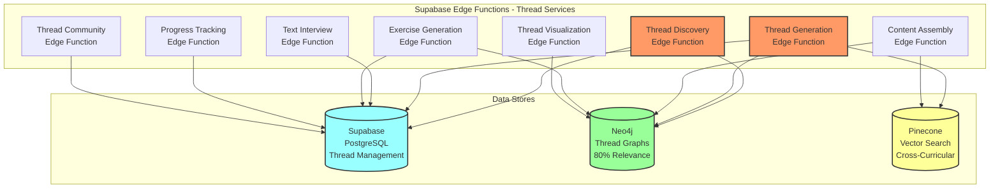

# Spool - Thread-Based Learning Entity Relationship Diagram (Supabase)

## Overview
This ERD defines the complete database schema for Spool's revolutionary Thread-based learning platform built on Supabase. Unlike traditional subject-based systems, Spool creates dynamic "Learning Threads" where students follow their curiosity across all subjects. The design leverages three storage systems:
- **Supabase PostgreSQL**: Thread management, user data, progress tracking, and system operations with Row Level Security
- **Neo4j AuraDB**: Thread graphs, cross-curricular relationships, and concept networks
- **Pinecone**: Vector embeddings for 80% relevance threshold enforcement and semantic search

All databases support the core Thread architecture where learning paths are dynamically assembled based on student curiosity, with Supabase Edge Functions providing the compute layer.

## Infrastructure Architecture



## Thread Management Tables (Supabase PostgreSQL)

### 1. **learning_threads**
Core Thread instances with learning goals and metadata.
```sql
CREATE TABLE learning_threads (
    id UUID PRIMARY KEY DEFAULT gen_random_uuid(),
    student_profile_id UUID REFERENCES student_profiles(id) ON DELETE CASCADE,
    
    -- Thread Definition
    goal TEXT NOT NULL, -- "I want to build a video game"
    goal_extracted_at TIMESTAMPTZ NOT NULL,
    goal_confidence_score DECIMAL(3,2), -- LLM confidence in goal extraction
    
    -- Thread Metadata
    title VARCHAR(255) NOT NULL, -- Auto-generated friendly title
    description TEXT,
    estimated_concepts INTEGER,
    estimated_hours INTEGER,
    
    -- Cross-Curricular Information
    subjects_involved VARCHAR(50)[] NOT NULL, -- Array of subjects in this Thread
    primary_subject VARCHAR(50) NOT NULL,
    complexity_score DECIMAL(3,2), -- 0.0-1.0 based on concept difficulty
    
    -- Thread Status
    status VARCHAR(50) DEFAULT 'active', -- 'active', 'paused', 'completed', 'branched', 'merged'
    visibility VARCHAR(50) DEFAULT 'private', -- 'private', 'shared', 'community', 'endorsed'
    
    -- Progress Tracking
    current_concept_id VARCHAR(255), -- References Neo4j concept
    concepts_completed INTEGER DEFAULT 0,
    concepts_total INTEGER DEFAULT 0,
    completion_percentage INTEGER GENERATED ALWAYS AS (
        CASE WHEN concepts_total > 0 THEN (concepts_completed * 100 / concepts_total) ELSE 0 END
    ) STORED,
    
    -- Timing
    started_at TIMESTAMPTZ DEFAULT NOW(),
    last_accessed_at TIMESTAMPTZ DEFAULT NOW(),
    completed_at TIMESTAMPTZ,
    estimated_completion_date DATE,
    
    -- Community Features
    is_shared BOOLEAN DEFAULT FALSE,
    share_code VARCHAR(20) UNIQUE, -- For sharing Threads
    remix_count INTEGER DEFAULT 0,
    endorsement_count INTEGER DEFAULT 0,
    
    created_at TIMESTAMPTZ DEFAULT NOW(),
    updated_at TIMESTAMPTZ DEFAULT NOW()
);

CREATE INDEX idx_threads_student ON learning_threads(student_profile_id);
CREATE INDEX idx_threads_status ON learning_threads(status);
CREATE INDEX idx_threads_subjects ON learning_threads USING GIN(subjects_involved);
CREATE INDEX idx_threads_shared ON learning_threads(is_shared, visibility);
CREATE INDEX idx_threads_current_concept ON learning_threads(current_concept_id);
```

### 2. **thread_concepts**
Maps concepts to Threads with relevance scores and sequencing.
```sql
CREATE TABLE thread_concepts (
    id UUID PRIMARY KEY DEFAULT gen_random_uuid(),
    thread_id UUID REFERENCES learning_threads(id) ON DELETE CASCADE,
    
    -- Concept Reference (from Neo4j)
    concept_id VARCHAR(255) NOT NULL,
    concept_name VARCHAR(255) NOT NULL,
    subject VARCHAR(50) NOT NULL,
    
    -- Thread Relevance (Critical: 80% threshold)
    relevance_score DECIMAL(4,2) NOT NULL, -- 0.80 to 1.00 (80-100%)
    relevance_explanation TEXT, -- Why this concept is relevant to Thread goal
    
    -- Sequencing
    sequence_order INTEGER NOT NULL,
    is_core_concept BOOLEAN DEFAULT TRUE, -- Core vs optional
    prerequisite_concept_ids VARCHAR(255)[], -- Array of prerequisite concept IDs
    
    -- Cross-Curricular Bridges
    bridge_from_concept_id VARCHAR(255), -- Previous concept from different subject
    bridge_explanation TEXT, -- How concepts connect across subjects
    bridge_strength DECIMAL(3,2), -- 0.0-1.0 connection strength
    
    -- Progress Status
    status VARCHAR(50) DEFAULT 'pending', -- 'pending', 'available', 'current', 'completed', 'skipped'
    unlocked_at TIMESTAMPTZ,
    started_at TIMESTAMPTZ,
    completed_at TIMESTAMPTZ,
    
    -- Mastery Tracking
    mastery_level DECIMAL(3,2), -- 0.0-1.0
    attempts_count INTEGER DEFAULT 0,
    time_spent_seconds INTEGER DEFAULT 0,
    
    created_at TIMESTAMPTZ DEFAULT NOW(),
    updated_at TIMESTAMPTZ DEFAULT NOW(),
    
    CONSTRAINT chk_relevance_threshold CHECK (relevance_score >= 0.80),
    CONSTRAINT unique_thread_concept UNIQUE(thread_id, concept_id)
);

CREATE INDEX idx_thread_concepts_thread ON thread_concepts(thread_id);
CREATE INDEX idx_thread_concepts_sequence ON thread_concepts(thread_id, sequence_order);
CREATE INDEX idx_thread_concepts_status ON thread_concepts(status);
CREATE INDEX idx_thread_concepts_relevance ON thread_concepts(relevance_score);
CREATE INDEX idx_thread_concepts_subject ON thread_concepts(subject);
```

### 3. **thread_branches**
Tracks Thread branching and evolution.
```sql
CREATE TABLE thread_branches (
    id UUID PRIMARY KEY DEFAULT gen_random_uuid(),
    parent_thread_id UUID REFERENCES learning_threads(id) ON DELETE CASCADE,
    child_thread_id UUID REFERENCES learning_threads(id) ON DELETE CASCADE,
    
    -- Branch Information
    branch_type VARCHAR(50) NOT NULL, -- 'curiosity', 'depth', 'related', 'merge'
    branch_reason TEXT NOT NULL, -- Why student wanted to branch
    branch_trigger_concept_id VARCHAR(255), -- Concept that triggered branch
    
    -- Branch Metadata
    divergence_point INTEGER, -- Sequence order where branch occurred
    shared_concepts_count INTEGER DEFAULT 0,
    unique_concepts_count INTEGER DEFAULT 0,
    
    -- Status
    is_active BOOLEAN DEFAULT TRUE,
    branch_created_at TIMESTAMPTZ DEFAULT NOW(),
    
    created_at TIMESTAMPTZ DEFAULT NOW()
);

CREATE INDEX idx_branches_parent ON thread_branches(parent_thread_id);
CREATE INDEX idx_branches_child ON thread_branches(child_thread_id);
CREATE INDEX idx_branches_type ON thread_branches(branch_type);
```

### 4. **thread_community**
Community features for sharing and collaboration.
```sql
CREATE TABLE thread_community (
    id UUID PRIMARY KEY DEFAULT gen_random_uuid(),
    thread_id UUID REFERENCES learning_threads(id) ON DELETE CASCADE,
    
    -- Sharing Information
    shared_by_user_id UUID REFERENCES users(id) ON DELETE CASCADE,
    share_type VARCHAR(50) NOT NULL, -- 'public', 'link_only', 'organization'
    share_title VARCHAR(255) NOT NULL,
    share_description TEXT,
    
    -- Community Metadata
    view_count INTEGER DEFAULT 0,
    remix_count INTEGER DEFAULT 0,
    endorsement_count INTEGER DEFAULT 0,
    favorite_count INTEGER DEFAULT 0,
    
    -- Tags and Categories
    tags VARCHAR(50)[] DEFAULT '{}',
    category VARCHAR(50), -- 'stem', 'arts', 'mixed', 'project_based'
    difficulty_rating VARCHAR(20), -- 'beginner', 'intermediate', 'advanced'
    
    -- Moderation
    is_featured BOOLEAN DEFAULT FALSE,
    is_approved BOOLEAN DEFAULT TRUE,
    moderation_notes TEXT,
    
    shared_at TIMESTAMPTZ DEFAULT NOW(),
    last_updated_at TIMESTAMPTZ DEFAULT NOW(),
    
    created_at TIMESTAMPTZ DEFAULT NOW()
);

CREATE INDEX idx_community_thread ON thread_community(thread_id);
CREATE INDEX idx_community_shared_by ON thread_community(shared_by_user_id);
CREATE INDEX idx_community_featured ON thread_community(is_featured);
CREATE INDEX idx_community_tags ON thread_community USING GIN(tags);
```

### 5. **thread_collaborations**
Multi-student Thread collaborations.
```sql
CREATE TABLE thread_collaborations (
    id UUID PRIMARY KEY DEFAULT gen_random_uuid(),
    thread_id UUID REFERENCES learning_threads(id) ON DELETE CASCADE,
    
    -- Collaboration Settings
    collaboration_type VARCHAR(50) NOT NULL, -- 'study_group', 'project_team', 'peer_review'
    max_participants INTEGER DEFAULT 5,
    current_participants INTEGER DEFAULT 1,
    
    -- Permissions
    can_invite_others BOOLEAN DEFAULT FALSE,
    can_modify_thread BOOLEAN DEFAULT FALSE,
    requires_approval BOOLEAN DEFAULT TRUE,
    
    -- Status
    status VARCHAR(50) DEFAULT 'active', -- 'active', 'completed', 'disbanded'
    
    created_at TIMESTAMPTZ DEFAULT NOW(),
    updated_at TIMESTAMPTZ DEFAULT NOW()
);

CREATE INDEX idx_collaborations_thread ON thread_collaborations(thread_id);
CREATE INDEX idx_collaborations_status ON thread_collaborations(status);
```

### 6. **thread_participants**
Participants in collaborative Threads.
```sql
CREATE TABLE thread_participants (
    collaboration_id UUID REFERENCES thread_collaborations(id) ON DELETE CASCADE,
    user_id UUID REFERENCES users(id) ON DELETE CASCADE,
    
    -- Participation Details
    role VARCHAR(50) NOT NULL, -- 'owner', 'moderator', 'participant'
    permissions JSONB DEFAULT '{}',
    
    -- Progress Sync
    individual_progress JSONB DEFAULT '{}', -- Personal progress in shared Thread
    shared_contributions JSONB DEFAULT '{}', -- Contributions to group
    
    -- Status
    status VARCHAR(50) DEFAULT 'active', -- 'active', 'left', 'removed'
    joined_at TIMESTAMPTZ DEFAULT NOW(),
    left_at TIMESTAMPTZ,
    
    PRIMARY KEY (collaboration_id, user_id)
);

CREATE INDEX idx_participants_user ON thread_participants(user_id);
CREATE INDEX idx_participants_role ON thread_participants(role);
```

### 7. **thread_portfolios**
Culminating projects that demonstrate Thread mastery.
```sql
CREATE TABLE thread_portfolios (
    id UUID PRIMARY KEY DEFAULT gen_random_uuid(),
    thread_id UUID REFERENCES learning_threads(id) ON DELETE CASCADE,
    student_profile_id UUID REFERENCES student_profiles(id) ON DELETE CASCADE,
    
    -- Portfolio Project
    project_type VARCHAR(50) NOT NULL, -- 'presentation', 'creation', 'research', 'application'
    project_title VARCHAR(255) NOT NULL,
    project_description TEXT NOT NULL,
    project_requirements JSONB NOT NULL, -- Specific requirements based on Thread
    
    -- Cross-Curricular Integration
    concepts_demonstrated VARCHAR(255)[] NOT NULL, -- Array of concept IDs
    subjects_integrated VARCHAR(50)[] NOT NULL, -- Subjects used in project
    cross_curricular_connections TEXT, -- How subjects connect in project
    
    -- Submission
    submission_format VARCHAR(50), -- 'video', 'document', 'presentation', 'website', 'app'
    submission_url VARCHAR(500),
    submission_files JSONB DEFAULT '[]', -- Array of file metadata
    
    -- Evaluation
    self_assessment JSONB, -- Student's self-evaluation
    peer_reviews JSONB DEFAULT '[]', -- Peer feedback
    educator_feedback TEXT,
    
    -- Scoring
    mastery_demonstration_score DECIMAL(3,2), -- How well it shows Thread mastery
    creativity_score DECIMAL(3,2),
    technical_execution_score DECIMAL(3,2),
    overall_score DECIMAL(3,2),
    
    -- Status
    status VARCHAR(50) DEFAULT 'draft', -- 'draft', 'submitted', 'reviewed', 'approved'
    submitted_at TIMESTAMPTZ,
    reviewed_at TIMESTAMPTZ,
    
    created_at TIMESTAMPTZ DEFAULT NOW(),
    updated_at TIMESTAMPTZ DEFAULT NOW()
);

CREATE INDEX idx_portfolios_thread ON thread_portfolios(thread_id);
CREATE INDEX idx_portfolios_student ON thread_portfolios(student_profile_id);
CREATE INDEX idx_portfolios_status ON thread_portfolios(status);
```

## Enhanced Student Profile Tables

### 8. **student_profiles** (Updated for Threads)
Extended student profiles with Thread-specific preferences.
```sql
-- Add Thread-specific columns to existing student_profiles table
ALTER TABLE student_profiles ADD COLUMN IF NOT EXISTS thread_preferences JSONB DEFAULT '{
    "preferred_thread_complexity": "moderate",
    "max_subjects_per_thread": 5,
    "preferred_thread_length": "medium",
    "collaboration_preference": "individual",
    "branching_frequency": "moderate"
}';

ALTER TABLE student_profiles ADD COLUMN IF NOT EXISTS active_threads_count INTEGER DEFAULT 0;
ALTER TABLE student_profiles ADD COLUMN IF NOT EXISTS completed_threads_count INTEGER DEFAULT 0;
ALTER TABLE student_profiles ADD COLUMN IF NOT EXISTS thread_mastery_score DECIMAL(3,2) DEFAULT 0.0;
```

### 9. **thread_progress_snapshots**
Periodic snapshots of Thread progress for analytics.
```sql
CREATE TABLE thread_progress_snapshots (
    id UUID PRIMARY KEY DEFAULT gen_random_uuid(),
    thread_id UUID REFERENCES learning_threads(id) ON DELETE CASCADE,
    student_profile_id UUID REFERENCES student_profiles(id) ON DELETE CASCADE,
    
    -- Snapshot Metadata
    snapshot_date DATE NOT NULL,
    snapshot_type VARCHAR(50) NOT NULL, -- 'daily', 'weekly', 'milestone', 'completion'
    
    -- Progress Data
    concepts_completed INTEGER NOT NULL,
    concepts_total INTEGER NOT NULL,
    subjects_touched VARCHAR(50)[] NOT NULL,
    average_mastery_score DECIMAL(3,2),
    
    -- Time Metrics
    total_time_minutes INTEGER DEFAULT 0,
    active_time_minutes INTEGER DEFAULT 0,
    session_count INTEGER DEFAULT 0,
    
    -- Engagement Metrics
    curiosity_events INTEGER DEFAULT 0, -- Times student explored branches
    collaboration_events INTEGER DEFAULT 0,
    help_seeking_events INTEGER DEFAULT 0,
    
    -- Predictions
    estimated_completion_date DATE,
    predicted_final_score DECIMAL(3,2),
    at_risk_indicators JSONB DEFAULT '{}',
    
    created_at TIMESTAMPTZ DEFAULT NOW(),
    
    CONSTRAINT unique_thread_snapshot UNIQUE(thread_id, student_profile_id, snapshot_date)
);

CREATE INDEX idx_snapshots_thread ON thread_progress_snapshots(thread_id);
CREATE INDEX idx_snapshots_date ON thread_progress_snapshots(snapshot_date);
CREATE INDEX idx_snapshots_student ON thread_progress_snapshots(student_profile_id);
```

## Thread-Enhanced Assessment Tables

### 10. **thread_assessments** (Enhanced from assessments)
Assessments with Thread context and cross-curricular evaluation.
```sql
CREATE TABLE thread_assessments (
    id UUID PRIMARY KEY DEFAULT gen_random_uuid(),
    student_profile_id UUID REFERENCES student_profiles(id) ON DELETE CASCADE,
    thread_id UUID REFERENCES learning_threads(id) ON DELETE CASCADE,
    concept_id VARCHAR(255) NOT NULL,
    
    -- Thread Context
    thread_goal_integration TEXT NOT NULL, -- How exercise relates to Thread goal
    cross_curricular_elements JSONB DEFAULT '{}', -- Other subjects involved
    thread_position_context TEXT, -- Where in Thread this occurs
    
    -- Assessment Content
    assessment_type VARCHAR(50) NOT NULL, -- 'initial_exercise', 'advanced_exercise', 'remediation', 'portfolio_checkpoint'
    exercise_prompt TEXT NOT NULL,
    expected_steps JSONB NOT NULL,
    
    -- Thread-Specific Requirements
    requires_cross_subject_thinking BOOLEAN DEFAULT FALSE,
    integration_concepts VARCHAR(255)[], -- Other concepts student must integrate
    real_world_application_required BOOLEAN DEFAULT FALSE,
    
    -- Student Response
    student_response TEXT NOT NULL,
    response_demonstrates_goal_connection BOOLEAN DEFAULT FALSE,
    cross_subject_connections_made JSONB DEFAULT '{}',
    
    -- Enhanced Evaluation
    step_evaluations JSONB NOT NULL,
    thread_goal_alignment_score DECIMAL(3,2), -- How well response aligns with Thread goal
    cross_curricular_integration_score DECIMAL(3,2), -- Integration quality
    conceptual_understanding DECIMAL(3,2),
    application_ability DECIMAL(3,2),
    overall_mastery_score DECIMAL(3,2),
    
    -- Thread Progress Impact
    unlocks_next_concepts BOOLEAN DEFAULT FALSE,
    enables_thread_branching BOOLEAN DEFAULT FALSE,
    qualifies_for_portfolio BOOLEAN DEFAULT FALSE,
    
    -- Status
    status VARCHAR(50) DEFAULT 'completed',
    submitted_at TIMESTAMPTZ DEFAULT NOW(),
    evaluated_at TIMESTAMPTZ,
    
    created_at TIMESTAMPTZ DEFAULT NOW()
);

CREATE INDEX idx_thread_assessments_thread ON thread_assessments(thread_id);
CREATE INDEX idx_thread_assessments_student ON thread_assessments(student_profile_id);
CREATE INDEX idx_thread_assessments_concept ON thread_assessments(concept_id);
CREATE INDEX idx_thread_assessments_goal_alignment ON thread_assessments(thread_goal_alignment_score);
```

## Neo4j Thread Graph Schema

### Enhanced Neo4j Schema for Thread-Based Learning

```cypher
// THREAD NODES

// Thread Node - Central entity representing learning journey
CREATE (t:Thread {
    id: 'thread_' + randomUUID(),
    goal: 'I want to build my own video game',
    title: 'Game Development Journey',
    student_id: 'student_123',
    
    // Thread Metadata
    estimated_concepts: 42,
    estimated_hours: 85,
    complexity_score: 0.75,
    subjects_involved: ['Math', 'Physics', 'Art', 'Computer Science', 'Business'],
    primary_subject: 'Computer Science',
    
    // Progress
    current_concept_sequence: 15,
    concepts_completed: 14,
    completion_percentage: 33,
    
    // Thread Characteristics
    allows_branching: true,
    collaboration_enabled: false,
    auto_generated: true,
    
    // Status
    status: 'active',
    created_at: datetime(),
    updated_at: datetime()
})

// Thread Concept Node - Concepts within a specific Thread context
CREATE (tc:ThreadConcept {
    id: 'thread_concept_' + randomUUID(),
    thread_id: 'thread_123',
    concept_id: 'concept_physics_vectors',
    
    // Thread-Specific Properties
    relevance_score: 0.87, // Must be >= 0.80
    relevance_explanation: 'Vector math is essential for game physics and movement',
    sequence_order: 15,
    is_core: true,
    
    // Cross-Curricular Context
    bridges_from_subject: 'Math',
    bridges_to_subject: 'Physics',
    bridge_explanation: 'Mathematical vectors become physical forces in game',
    
    // Status in Thread
    status: 'current',
    unlocked_at: datetime(),
    estimated_minutes: 45,
    
    created_at: datetime()
})

// ENHANCED CONCEPT NODES WITH THREAD AWARENESS

// Concept Node (Enhanced for cross-curricular)
CREATE (c:Concept {
    id: 'concept_physics_vectors',
    name: 'Vector Mathematics in Physics',
    subject: 'Physics',
    
    // Cross-Curricular Properties
    appears_in_subjects: ['Math', 'Physics', 'Computer Science'],
    prerequisite_subjects: ['Math'],
    enables_subjects: ['Computer Science', 'Engineering'],
    
    // Thread Compatibility
    common_thread_goals: ['game development', 'robotics', 'animation'],
    typical_relevance_scores: {'game_development': 0.92, 'robotics': 0.88},
    
    // Content References
    pinecone_vector_ids: ['vec_123', 'vec_124'],
    content_chunks: 8,
    
    // Learning Properties
    estimated_minutes: 45,
    difficulty_level: 'intermediate',
    mastery_threshold: 0.80,
    
    created_at: datetime()
})

// CROSS-CURRICULAR BRIDGE NODES

// Bridge Node - Explicit connections between subjects
CREATE (b:Bridge {
    id: 'bridge_' + randomUUID(),
    from_concept_id: 'concept_math_vectors',
    to_concept_id: 'concept_physics_vectors',
    
    // Bridge Properties
    bridge_type: 'application', // 'prerequisite', 'application', 'analogy', 'contrast'
    explanation: 'Mathematical vector operations become physical force calculations',
    strength: 0.95, // How strong the connection is
    
    // Thread Context
    common_in_threads: ['game_development', 'robotics', 'physics_simulation'],
    effectiveness_score: 0.89, // How well students understand the connection
    
    // Metadata
    author_type: 'system', // 'system', 'educator', 'ai_generated'
    validation_status: 'approved',
    
    created_at: datetime()
})

// THREAD RELATIONSHIPS

// Thread Contains Concepts (with rich properties)
(t:Thread)-[:CONTAINS {
    sequence: 15,
    relevance: 0.87,
    is_core: true,
    unlocked_at: datetime(),
    status: 'current',
    bridge_from_concept: 'concept_math_vectors',
    bridge_explanation: 'Math vectors become physics forces'
}]->(c:Concept)

// Thread Branches (for exploration paths)
(t1:Thread)-[:BRANCHES_TO {
    branch_type: 'curiosity_driven',
    branch_reason: 'Student interested in 3D graphics',
    divergence_point: 20,
    created_at: datetime()
}]->(t2:Thread)

// Thread Prerequisites (between Threads)
(t1:Thread)-[:ENABLES_THREAD {
    shared_concepts: ['concept_basic_math', 'concept_logic'],
    prerequisite_strength: 'recommended' // 'required', 'recommended', 'helpful'
}]->(t2:Thread)

// CROSS-CURRICULAR RELATIONSHIPS

// Concept Bridges Across Subjects
(c1:Concept)-[:BRIDGES_TO {
    bridge_id: 'bridge_123',
    explanation: 'Mathematical vectors become physical forces',
    strength: 0.95,
    thread_contexts: ['game_development', 'robotics'],
    effectiveness_score: 0.89
}]->(c2:Concept)

// Subject Integration
(s1:Subject)-[:INTEGRATES_WITH {
    integration_strength: 0.92,
    common_threads: ['stem_projects', 'game_development'],
    typical_sequence: 'math_first' // 'math_first', 'parallel', 'science_first'
}]->(s2:Subject)

// THREAD COMMUNITY RELATIONSHIPS

// Thread Sharing
(u:User)-[:SHARED {
    share_type: 'public',
    endorsements: 15,
    remixes: 3,
    shared_at: datetime()
}]->(t:Thread)

// Thread Remixing (Thread inheritance)
(t1:Thread)-[:REMIXED_FROM {
    changes_made: ['added_art_concepts', 'removed_advanced_math'],
    similarity_score: 0.73,
    attribution: 'Original by Teacher Jane',
    remix_reason: 'Adapted for younger students'
}]->(t2:Thread)

// Thread Endorsements
(e:Educator)-[:ENDORSES {
    endorsement_type: 'curriculum_aligned',
    quality_score: 0.95,
    recommended_for: ['grades_6_8', 'stem_focus'],
    endorsement_notes: 'Excellent progression and real-world connections'
}]->(t:Thread)

// STUDENT PROGRESS RELATIONSHIPS

// Student Following Thread
(s:Student)-[:FOLLOWING {
    started_at: datetime(),
    current_concept: 'concept_physics_vectors',
    progress_percentage: 35,
    mastery_scores: {
        'concept_math_vectors': 0.92,
        'concept_basic_physics': 0.87
    },
    engagement_level: 'high',
    last_activity: datetime()
}]->(t:Thread)

// Student Mastery in Thread Context
(s:Student)-[:MASTERED_IN_THREAD {
    thread_id: 'thread_123',
    mastery_score: 0.91,
    mastered_at: datetime(),
    time_to_mastery_minutes: 67,
    attempts_needed: 2,
    thread_context_helped: true
}]->(c:Concept)
```

## Pinecone Vector Schema for Thread-Based Search

### Enhanced Vector Metadata for Thread Relevance

```javascript
{
  id: "thread_concept_physics_vectors_001",
  values: [...], // 1536-dimensional embedding
  
  metadata: {
    // Thread-Specific Properties
    thread_compatible_goals: [
      "game development", 
      "robotics", 
      "animation", 
      "physics simulation"
    ],
    typical_relevance_scores: {
      "game_development": 0.92,
      "robotics": 0.88,
      "animation": 0.85,
      "physics_simulation": 0.95
    },
    
    // Cross-Curricular Information
    primary_subject: "Physics",
    secondary_subjects: ["Math", "Computer Science"],
    prerequisite_subjects: ["Math"],
    enables_subjects: ["Computer Science", "Engineering"],
    
    // Thread Position Context
    typical_thread_position: "mid", // 'early', 'mid', 'late'
    serves_as_bridge: true,
    bridge_from_concepts: ["math_vectors", "basic_algebra"],
    bridge_to_concepts: ["game_physics", "3d_graphics"],
    
    // Content Classification
    concept_id: "concept_physics_vectors",
    content_type: "explanation",
    difficulty_level: "intermediate",
    
    // Actual Content
    text: "Vectors in physics represent both magnitude and direction...",
    thread_explanation: "In game development, vectors control character movement and physics interactions",
    real_world_applications: ["Game character movement", "Robot navigation", "Animation paths"],
    
    // Quality Metrics for Thread Assembly
    clarity_for_goal_connection: 0.94,
    cross_subject_bridge_quality: 0.91,
    student_engagement_score: 0.88,
    
    // Thread Assembly Hints
    works_well_after: ["basic_math", "coordinate_systems"],
    enables_concepts: ["physics_engines", "collision_detection"],
    common_misconceptions_in_threads: ["Confusing velocity with acceleration in games"],
    
    // Personalization Hints
    interest_compatibility: {
      "gaming": 0.95,
      "sports": 0.78,
      "technology": 0.92,
      "art": 0.65
    },
    
    last_updated: "2024-01-15T10:30:00Z"
  }
}
```

## Key Architecture Enhancements for Thread-Based Learning

### 1. **Thread-Centric Design**
- All data structures center around learning Threads rather than subjects
- Thread goals drive content assembly and relevance scoring
- Cross-curricular relationships are first-class entities

### 2. **80% Relevance Threshold Enforcement**
- Database constraints ensure only ≥80% relevant content in Threads
- Relevance scores tracked at concept and Thread level
- Quality metrics for Thread assembly effectiveness

### 3. **Cross-Curricular Integration**
- Bridge entities explicitly model subject connections
- Neo4j relationships capture complex cross-subject prerequisites
- Vector metadata includes cross-curricular compatibility

### 4. **Thread Community Features**
- Sharing, remixing, and collaboration built into data model
- Thread templates and community library support
- Educator endorsement and quality scoring

### 5. **Dynamic Thread Evolution**
- Branching and merging support for exploratory learning
- Thread evolution tracking with full audit trail
- Adaptive sequencing based on student progress

### 6. **Portfolio-Based Assessment**
- Culminating projects that demonstrate Thread mastery
- Cross-curricular integration requirements
- Real-world application validation

### 7. **Enhanced Analytics**
- Thread-specific progress metrics
- Cross-subject learning transfer tracking
- Curiosity-driven exploration measurement

## Data Integrity for Thread Architecture

### Thread-Specific Constraints
```sql
-- Ensure Thread concepts meet relevance threshold
ALTER TABLE thread_concepts ADD CONSTRAINT chk_relevance_80_percent 
    CHECK (relevance_score >= 0.80);

-- Ensure Threads have multiple subjects
ALTER TABLE learning_threads ADD CONSTRAINT chk_cross_curricular 
    CHECK (array_length(subjects_involved, 1) >= 2);

-- Ensure proper Thread progression
ALTER TABLE thread_concepts ADD CONSTRAINT chk_valid_sequence 
    CHECK (sequence_order > 0);

-- Portfolio requires Thread completion
ALTER TABLE thread_portfolios ADD CONSTRAINT chk_portfolio_timing 
    CHECK (
        (SELECT completion_percentage FROM learning_threads 
         WHERE id = thread_id) >= 80
    );
```

### Performance Optimization for Thread Queries
```sql
-- Optimized indexes for Thread operations
CREATE INDEX CONCURRENTLY idx_thread_concepts_relevance_sequence 
    ON thread_concepts(thread_id, relevance_score DESC, sequence_order);

CREATE INDEX CONCURRENTLY idx_threads_progress_status 
    ON learning_threads(completion_percentage, status) 
    WHERE status = 'active';

-- Materialized view for popular Thread patterns
CREATE MATERIALIZED VIEW popular_thread_patterns AS
SELECT 
    subjects_involved,
    COUNT(*) as thread_count,
    AVG(completion_percentage) as avg_completion,
    AVG(estimated_hours) as avg_duration
FROM learning_threads 
WHERE status IN ('completed', 'active')
GROUP BY subjects_involved
HAVING COUNT(*) >= 5;
```

This Thread-based ERD provides the complete data foundation for Spool's revolutionary learning platform where student curiosity drives dynamic, cross-curricular learning journeys with intelligent content assembly and 80% relevance quality assurance.