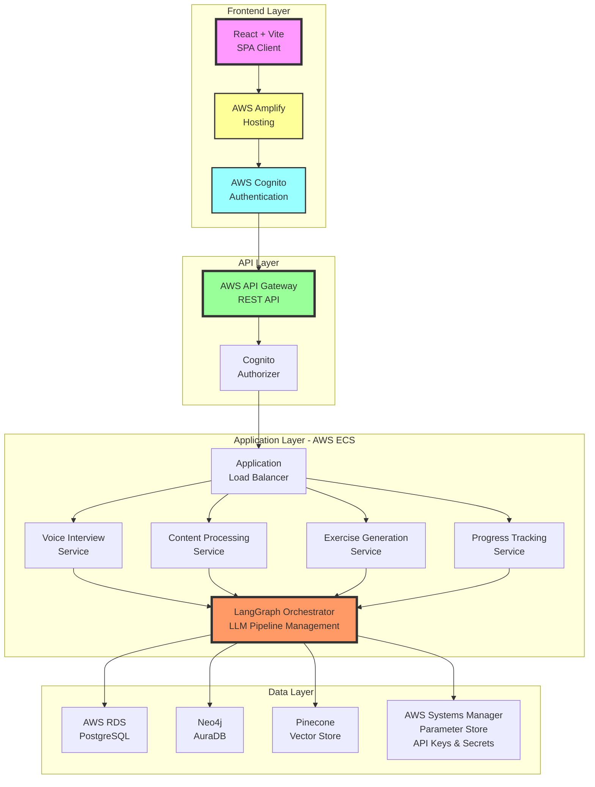
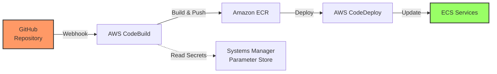
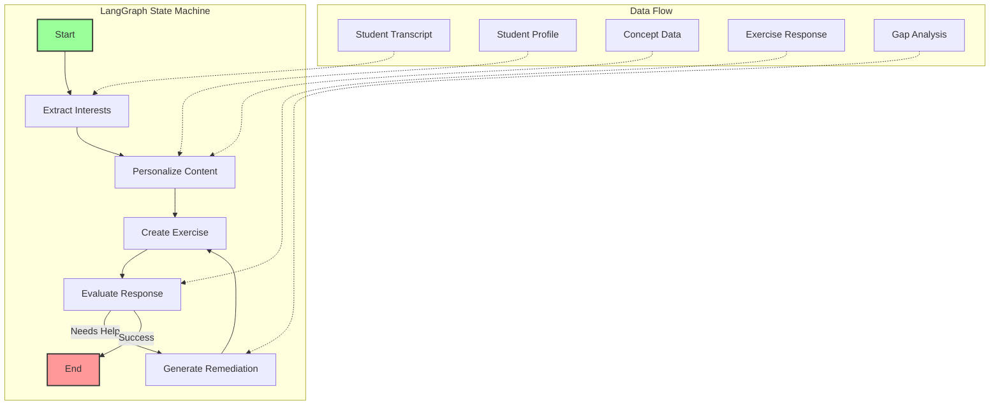
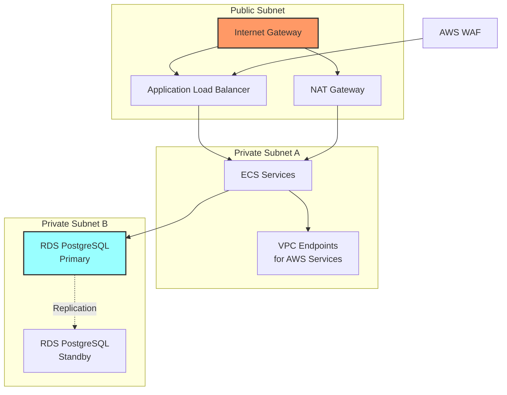
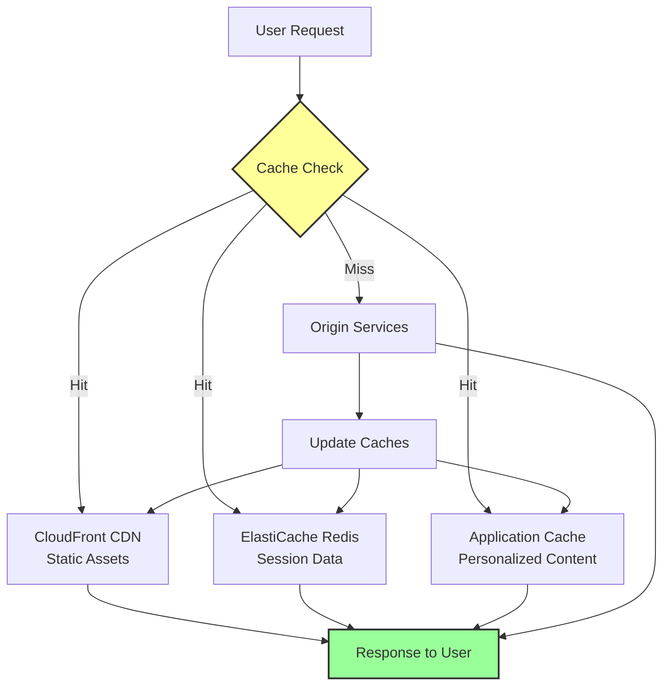
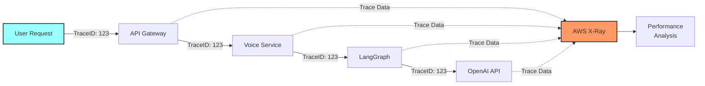
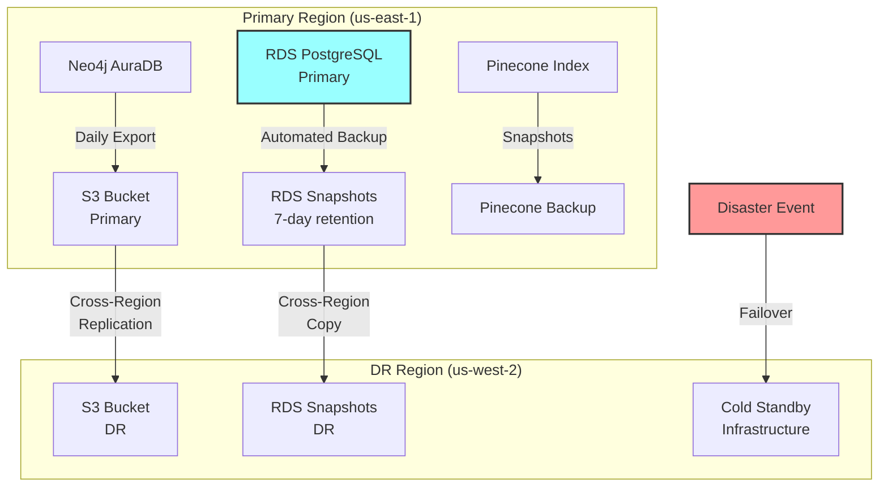
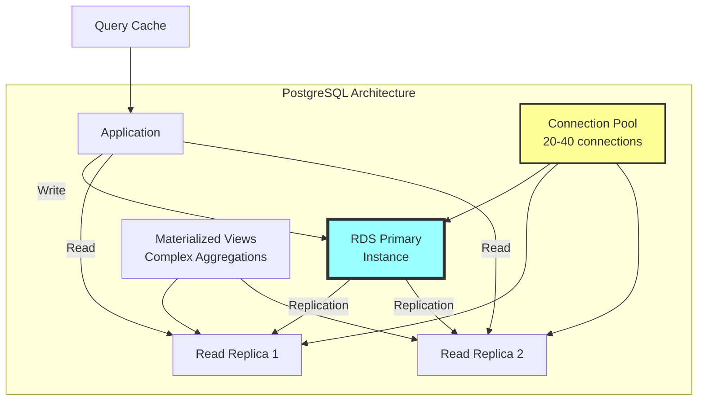

# Spool - System Architecture Document

## 1. Architecture Overview

The Spool system architecture is designed as a modern, cloud-native application leveraging AWS services for scalability, reliability, and security. The architecture follows a microservices pattern with clear separation of concerns between frontend, backend services, and data storage layers.



## 2. Component Architecture

### 2.1 Frontend Layer

#### React + Vite Application
**Purpose**: Single Page Application providing the user interface
**Responsibilities**:
- Voice interview interface with WebRTC
- Real-time chat transcript display
- Concept display with three-component system
- Exercise interface with thought process capture
- Progress visualization and gamification
- Parent/educator dashboards

**Key Libraries**:
```javascript
{
  "dependencies": {
    "react": "^18.2.0",
    "react-router-dom": "^6.x",
    "aws-amplify": "^6.x",
    "@aws-amplify/ui-react": "^6.x",
    "simple-peer": "^9.x", // WebRTC
    "d3": "^7.x", // Progress visualization
    "framer-motion": "^11.x", // Animations
    "react-query": "^3.x", // Data fetching
    "tailwindcss": "^3.x" // Styling
  }
}
```

#### AWS Amplify Hosting
**Configuration**:
```yaml
version: 1
frontend:
  phases:
    preBuild:
      commands:
        - npm ci
    build:
      commands:
        - npm run build
  artifacts:
    baseDirectory: dist
    files:
      - '**/*'
  cache:
    paths:
      - node_modules/**/*
```

#### AWS Cognito Integration
**User Pools Configuration**:
- User attributes: email, name, role (student/parent/educator/admin)
- MFA: Optional for educators/admins
- Password policy: Minimum 8 characters
- User groups: students, parents, educators, admins
- OAuth flows: Authorization code grant
- Token expiration: 1 hour access, 30 days refresh

### 2.2 Application Layer (Microservices)

#### CI/CD Pipeline



**CodeBuild buildspec.yml**:
```yaml
version: 0.2
phases:
  pre_build:
    commands:
      - echo Logging in to Amazon ECR...
      - aws ecr get-login-password --region $AWS_DEFAULT_REGION | docker login --username AWS --password-stdin $AWS_ACCOUNT_ID.dkr.ecr.$AWS_DEFAULT_REGION.amazonaws.com
  build:
    commands:
      - echo Build started on `date`
      - docker build -t $IMAGE_REPO_NAME:$IMAGE_TAG .
      - docker tag $IMAGE_REPO_NAME:$IMAGE_TAG $AWS_ACCOUNT_ID.dkr.ecr.$AWS_DEFAULT_REGION.amazonaws.com/$IMAGE_REPO_NAME:$IMAGE_TAG
  post_build:
    commands:
      - echo Pushing Docker image...
      - docker push $AWS_ACCOUNT_ID.dkr.ecr.$AWS_DEFAULT_REGION.amazonaws.com/$IMAGE_REPO_NAME:$IMAGE_TAG
      - printf '[{"name":"%s","imageUri":"%s"}]' $CONTAINER_NAME $AWS_ACCOUNT_ID.dkr.ecr.$AWS_DEFAULT_REGION.amazonaws.com/$IMAGE_REPO_NAME:$IMAGE_TAG > imagedefinitions.json
artifacts:
  files: imagedefinitions.json
```

#### ECS Service Architecture

**1. Voice Interview Service**
```python
# Container configuration
{
  "cpu": "512",
  "memory": "1024",
  "environment": [
    {"name": "SERVICE_NAME", "value": "voice-interview"},
    {"name": "WHISPER_API_ENDPOINT", "valueFrom": "arn:aws:ssm:region:account:parameter/whisper-api-key"}
  ],
  "portMappings": [{"containerPort": 8001, "protocol": "tcp"}]
}
```

**Responsibilities**:
- WebRTC signaling server
- Audio stream processing
- Whisper API integration for transcription
- Real-time chat updates via WebSocket
- Interest extraction using LangGraph

**2. Content Processing Service**
```python
# Container configuration
{
  "cpu": "1024",
  "memory": "2048",
  "environment": [
    {"name": "SERVICE_NAME", "value": "content-processor"},
    {"name": "OPENAI_API_KEY", "valueFrom": "arn:aws:ssm:region:account:parameter/openai-api-key"}
  ],
  "portMappings": [{"containerPort": 8002, "protocol": "tcp"}]
}
```

**Responsibilities**:
- PDF text extraction
- Content chunking and structuring
- Vector embedding generation
- Neo4j graph construction
- Hook content generation

**3. Exercise Generation Service**
```python
# Container configuration
{
  "cpu": "512",
  "memory": "1024",
  "environment": [
    {"name": "SERVICE_NAME", "value": "exercise-generator"},
    {"name": "LANGGRAPH_CONFIG", "valueFrom": "arn:aws:ssm:region:account:parameter/langgraph-config"}
  ],
  "portMappings": [{"containerPort": 8003, "protocol": "tcp"}]
}
```

**Responsibilities**:
- Dynamic exercise creation
- Interest-based personalization
- Life category integration
- Advanced exercise generation
- Remediation content creation

**4. Progress Tracking Service**
```python
# Container configuration
{
  "cpu": "256",
  "memory": "512",
  "environment": [
    {"name": "SERVICE_NAME", "value": "progress-tracker"}
  ],
  "portMappings": [{"containerPort": 8004, "protocol": "tcp"}]
}
```

**Responsibilities**:
- Progress calculations
- Gamification logic
- Achievement processing
- Report generation
- Alert management

### 2.3 LangGraph Orchestration Layer

**Purpose**: Centralized LLM pipeline management for all AI operations



**Configuration**:
```python
from langgraph.graph import StateGraph, END
from typing import TypedDict, List

class SpoolState(TypedDict):
    student_id: str
    interests: List[str]
    current_concept: str
    response: str
    evaluation: dict

# Define the graph
workflow = StateGraph(SpoolState)

# Add nodes for each process
workflow.add_node("extract_interests", extract_interests_from_transcript)
workflow.add_node("personalize_content", generate_personalized_content)
workflow.add_node("create_exercise", generate_contextual_exercise)
workflow.add_node("evaluate_response", analyze_student_response)
workflow.add_node("generate_remediation", create_targeted_remediation)

# Define edges
workflow.add_edge("extract_interests", "personalize_content")
workflow.add_conditional_edges(
    "evaluate_response",
    lambda x: "generate_remediation" if x["evaluation"]["needs_help"] else END
)

# Compile
app = workflow.compile()
```

**Key Pipelines**:
1. **Interest Extraction Pipeline**: Transcript → NLP Analysis → Categorization
2. **Content Personalization Pipeline**: Concept + Interests → Personalized Content
3. **Exercise Generation Pipeline**: Concept + Context → Dynamic Exercise
4. **Evaluation Pipeline**: Response → Step Analysis → Feedback
5. **Remediation Pipeline**: Gap Analysis → Targeted Content

### 2.4 Data Layer Architecture

#### AWS RDS PostgreSQL
**Instance Configuration**:
- Instance class: db.r6g.large (for production)
- Storage: 100GB GP3 with autoscaling
- Multi-AZ deployment for high availability
- Automated backups: 7-day retention
- Encryption at rest using AWS KMS

**Connection Pooling**:
```python
from sqlalchemy import create_engine
from sqlalchemy.pool import QueuePool

engine = create_engine(
    DATABASE_URL,
    pool_size=20,
    max_overflow=40,
    pool_pre_ping=True,
    pool_recycle=3600
)
```

#### Neo4j AuraDB
**Configuration**:
- Tier: Professional (8GB RAM)
- Region: Same as ECS for low latency
- Backup: Daily automated
- Connection: Bolt protocol over TLS

**Connection Management**:
```python
from neo4j import GraphDatabase

class Neo4jConnection:
    def __init__(self, uri, user, password):
        self.driver = GraphDatabase.driver(
            uri, 
            auth=(user, password),
            max_connection_pool_size=50,
            connection_acquisition_timeout=30
        )
```

#### Pinecone Vector Store
**Index Configuration**:
```python
import pinecone

pinecone.init(
    api_key=os.getenv("PINECONE_API_KEY"),
    environment="us-east-1-aws"
)

index = pinecone.Index("spool-content")

# Index settings
{
    "dimension": 1536,
    "metric": "cosine",
    "pods": 2,
    "replicas": 1,
    "pod_type": "p1.x1"
}
```

### 2.5 Infrastructure as Code

**AWS CDK Stack Example**:
```typescript
export class SpoolInfrastructureStack extends cdk.Stack {
  constructor(scope: Construct, id: string, props?: cdk.StackProps) {
    super(scope, id, props);

    // VPC
    const vpc = new ec2.Vpc(this, 'SpoolVPC', {
      maxAzs: 2,
      natGateways: 1
    });

    // ECS Cluster
    const cluster = new ecs.Cluster(this, 'SpoolCluster', {
      vpc,
      containerInsights: true
    });

    // RDS Instance
    const database = new rds.DatabaseInstance(this, 'SpoolDB', {
      engine: rds.DatabaseInstanceEngine.postgres({
        version: rds.PostgresEngineVersion.VER_15_3
      }),
      instanceType: ec2.InstanceType.of(
        ec2.InstanceClass.R6G,
        ec2.InstanceSize.LARGE
      ),
      vpc,
      multiAz: true,
      allocatedStorage: 100,
      storageType: rds.StorageType.GP3,
      storageEncrypted: true
    });

    // Task Definitions and Services
    const voiceInterviewTaskDef = new ecs.FargateTaskDefinition(
      this,
      'VoiceInterviewTask',
      {
        memoryLimitMiB: 1024,
        cpu: 512
      }
    );

    // Add containers and services...
  }
}
```

## 3. Security Architecture

### 3.1 Network Security



- VPC with public/private subnets
- NAT Gateway for outbound traffic
- Security groups with least privilege
- AWS WAF for API Gateway protection
- VPC endpoints for AWS services

### 3.2 Authentication & Authorization
```javascript
// Cognito configuration
const userPool = new cognito.UserPool(this, 'SpoolUserPool', {
  userPoolName: 'spool-users',
  selfSignUpEnabled: false,
  signInAliases: {
    email: true
  },
  standardAttributes: {
    email: {
      required: true,
      mutable: false
    }
  },
  customAttributes: {
    role: new cognito.StringAttribute({
      minLen: 3,
      maxLen: 20
    }),
    organizationId: new cognito.StringAttribute({
      minLen: 36,
      maxLen: 36
    })
  },
  passwordPolicy: {
    minLength: 8,
    requireLowercase: true,
    requireUppercase: true,
    requireDigits: true
  }
});
```

### 3.3 Secrets Management

```mermaid
graph LR
    subgraph "AWS Systems Manager Parameter Store"
        A[/spool/prod/database/connection-string]
        B[/spool/prod/openai/api-key]
        C[/spool/prod/pinecone/api-key]
        D[/spool/prod/neo4j/connection-uri]
        E[/spool/prod/neo4j/username]
        F[/spool/prod/neo4j/password]
    end
    
    G[ECS Task Role] -->|GetParameter| A
    G -->|GetParameter| B
    G -->|GetParameter| C
    G -->|GetParameter| D
    G -->|GetParameter| E
    G -->|GetParameter| F
    
    H[KMS] -->|Decrypt| A
    H -->|Decrypt| B
    H -->|Decrypt| C
    
    style G fill:#9f9,stroke:#333,stroke-width:2px
    style H fill:#ff9,stroke:#333,stroke-width:2px
```

**Secure parameter access**:
```python
# Secure parameter access
def get_secret(parameter_name):
    ssm = boto3.client('ssm')
    response = ssm.get_parameter(
        Name=parameter_name,
        WithDecryption=True
    )
    return response['Parameter']['Value']

# Parameters structure
/spool/prod/database/connection-string
/spool/prod/openai/api-key
/spool/prod/pinecone/api-key
/spool/prod/neo4j/connection-uri
/spool/prod/neo4j/username
/spool/prod/neo4j/password
```

## 4. Scalability Patterns

### 4.1 Auto Scaling Configuration
```yaml
# ECS Service Auto Scaling
TargetTrackingScalingPolicy:
  TargetValue: 70.0
  PredefinedMetricType: ECSServiceAverageCPUUtilization
  ScaleInCooldown: 60
  ScaleOutCooldown: 60

# Min/Max Tasks
MinCapacity: 2
MaxCapacity: 10
```

### 4.2 Caching Strategy



- CloudFront for static assets
- ElastiCache Redis for session data
- Application-level caching for personalized content
- Database query result caching

### 4.3 Queue Architecture
```python
# SQS for async processing
exercise_queue = sqs.Queue(
    self,
    'ExerciseGenerationQueue',
    visibility_timeout=cdk.Duration.seconds(300),
    dead_letter_queue=dlq.DeadLetterQueue(
        max_receive_count=3,
        queue=dlq_queue
    )
)
```

## 5. Monitoring & Observability

### 5.1 CloudWatch Integration
```python
# Custom metrics
cloudwatch = boto3.client('cloudwatch')

def put_metric(metric_name, value, unit='Count'):
    cloudwatch.put_metric_data(
        Namespace='Spool/Application',
        MetricData=[
            {
                'MetricName': metric_name,
                'Value': value,
                'Unit': unit
            }
        ]
    )
```

### 5.2 Distributed Tracing



- AWS X-Ray for request tracing
- Correlation IDs across services
- Performance bottleneck identification

### 5.3 Logging Architecture
```python
# Structured logging
import structlog

logger = structlog.get_logger()
logger.info(
    "exercise_generated",
    student_id=student_id,
    concept_id=concept_id,
    personalization_category=category,
    generation_time_ms=elapsed_time
)
```

## 6. Disaster Recovery



### 6.1 Backup Strategy
- RDS automated backups (7-day retention)
- Neo4j daily exports to S3
- Pinecone index snapshots
- Cross-region replication for critical data

### 6.2 Recovery Objectives
- RTO (Recovery Time Objective): 4 hours
- RPO (Recovery Point Objective): 1 hour
- Automated failover for multi-AZ resources

## 7. Performance Optimization

### 7.1 Database Optimization



- Read replicas for PostgreSQL
- Connection pooling
- Query optimization and indexing
- Materialized views for complex aggregations

### 7.2 Content Delivery
- Pre-generated content for common interest combinations
- Lazy loading for heavy assets
- Progressive enhancement
- Edge caching for global performance

### 7.3 LLM Optimization
- Response caching for common queries
- Batch processing where applicable
- Fallback models for reliability
- Token usage optimization

This architecture provides a scalable, secure, and maintainable foundation for the Spool personalized learning platform, with clear separation of concerns and modern cloud-native patterns throughout.