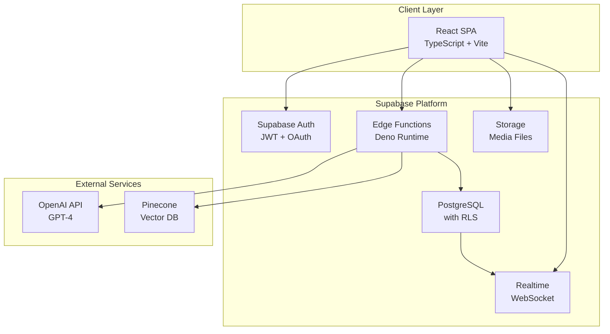
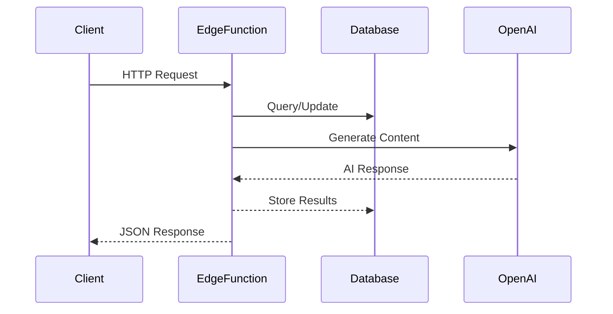
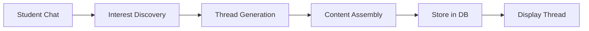
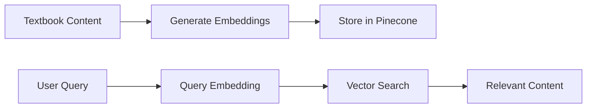

# System Architecture - Thread-Based Learning Platform

**Version:** 3.0  
**Status:** Production Architecture
**Last Updated:** 2024

## 1. Overview

The Spool Learning Platform utilizes a Thread-based architecture that connects concepts across traditional subject boundaries. Built entirely on Supabase infrastructure, the platform leverages Edge Functions for serverless compute and Supabase's integrated PostgreSQL database for all data management needs.

## 2. Technology Stack

### 2.1 Core Infrastructure

| Component | Technology | Purpose |
|-----------|-----------|---------|
| **Frontend** | React + TypeScript | Single-page application |
| **Database** | Supabase PostgreSQL with RLS | Primary data store with security |
| **Compute** | Supabase Edge Functions | Serverless AI processing |
| **Authentication** | Supabase Auth | User authentication & authorization |
| **Storage** | Supabase Storage | Media and document storage |
| **Vector Database** | Pinecone | Semantic search and embeddings |
| **AI/ML** | OpenAI GPT-4 | Content generation and analysis |

### 2.2 Development Stack

- **Package Manager**: npm
- **Build Tool**: Vite
- **CSS Framework**: Tailwind CSS
- **State Management**: React Query + Context API
- **Type Safety**: TypeScript
- **Testing**: Vitest + Testing Library

## 3. Architecture Diagram



## 4. Database Architecture

### 4.1 Core Tables

```sql
-- Thread Management
learning_threads
thread_concepts
thread_sections
thread_branches

-- User Management
users (Supabase Auth)
student_profiles
student_progress

-- Content
textbooks
assessments
exercises

-- Social Features
community_shares
portfolio_items
```

### 4.2 Key Relationships

- Threads contain multiple Concepts
- Concepts can belong to multiple Threads
- Students progress through Threads via Branches
- All tables protected by Row Level Security

## 5. Edge Functions Architecture

### 5.1 Core Functions

| Function | Purpose | Integrations |
|----------|---------|--------------|
| interest-discovery | Chat-based interest discovery | OpenAI, PostgreSQL |
| thread-discovery | Extract learning goals | OpenAI, PostgreSQL |
| thread-generation | Generate learning threads | OpenAI, Pinecone, PostgreSQL |
| content-assembly | Assemble concept content | OpenAI, PostgreSQL |
| exercise-generation | Create exercises | OpenAI, PostgreSQL |
| progress-tracking | Track achievements | PostgreSQL |

### 5.2 Function Communication



## 6. Security Architecture

### 6.1 Authentication Flow

1. User signs up/logs in via Supabase Auth
2. JWT token issued with user metadata
3. Token included in all API requests
4. Edge Functions verify token
5. RLS policies enforce data access

### 6.2 Security Layers

- **Network**: HTTPS everywhere
- **API**: JWT authentication
- **Database**: Row Level Security
- **Functions**: Input validation
- **Storage**: Bucket policies

## 7. Data Flow

### 7.1 Thread Creation Flow



### 7.2 Learning Flow

1. Student explores Thread
2. Selects Concept
3. Views content
4. Completes exercises
5. Progress tracked
6. Next concept unlocked

## 8. Pinecone Integration

### 8.1 Index Structure

- **Index**: spool-textbook-embeddings
- **Dimensions**: 1536 (OpenAI embeddings)
- **Metric**: Cosine similarity

### 8.2 Data Pipeline



## 9. Performance Optimization

### 9.1 Database
- Indexes on frequently queried columns
- Materialized views for complex queries
- Connection pooling via Supabase

### 9.2 Frontend
- Code splitting
- Lazy loading
- React Query caching
- Optimistic updates

### 9.3 Edge Functions
- Efficient SQL queries
- Parallel API calls
- Response caching where appropriate

## 10. Monitoring & Observability

### 10.1 Metrics
- Supabase Dashboard metrics
- Edge Function execution logs
- Database query performance
- User engagement analytics

### 10.2 Error Tracking
- Structured logging in Edge Functions
- Client-side error boundaries
- Supabase error notifications

## 11. Deployment Architecture

### 11.1 Environments
- **Development**: Local Supabase instance
- **Staging**: Separate Supabase project
- **Production**: Production Supabase project

### 11.2 CI/CD Pipeline
1. Code push to GitHub
2. GitHub Actions run tests
3. Deploy Edge Functions via Supabase CLI
4. Frontend deployed to Vercel/Netlify
5. Database migrations via Supabase CLI

## 12. Scalability Considerations

### 12.1 Horizontal Scaling
- Supabase handles database scaling
- Edge Functions scale automatically
- CDN for static assets

### 12.2 Data Partitioning
- Thread data partitioned by creation date
- User data isolated via RLS
- Efficient indexing strategies

## 13. Future Architecture Considerations

### 13.1 Planned Enhancements
- GraphQL API layer
- Mobile applications
- Offline support
- Advanced analytics

### 13.2 Technology Evaluation
- Continuous evaluation of new Supabase features
- Performance monitoring and optimization
- Security updates and best practices

## 14. Architecture Decision Records

### 14.1 Supabase Selection
- **Decision**: Use Supabase as primary infrastructure
- **Rationale**: Integrated platform with auth, database, storage, and compute
- **Benefits**: Reduced complexity, built-in security, real-time features

### 14.2 Thread-Based Learning
- **Decision**: Organize content in interconnected threads
- **Rationale**: Reflects real-world knowledge connections
- **Benefits**: Personalized learning paths, cross-curricular understanding

### 14.3 Edge Functions for AI
- **Decision**: Use Edge Functions for AI processing
- **Rationale**: Serverless scaling, close to data
- **Benefits**: Cost-effective, low latency, automatic scaling