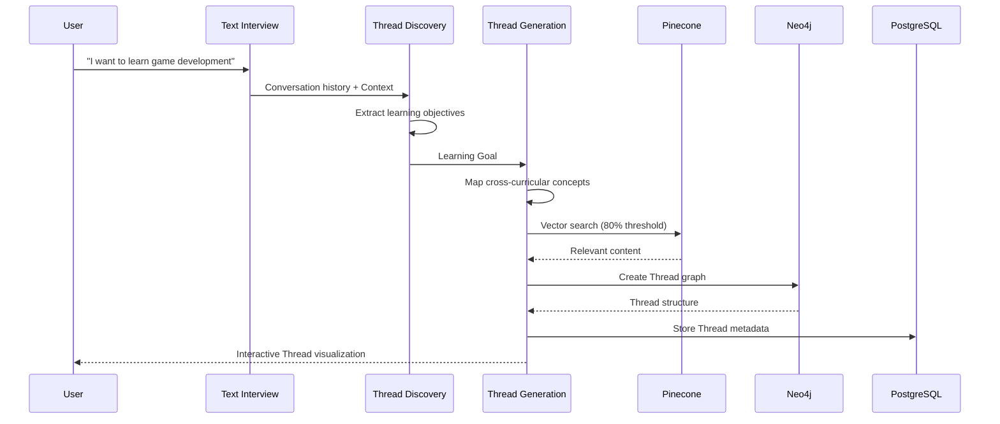
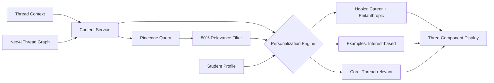
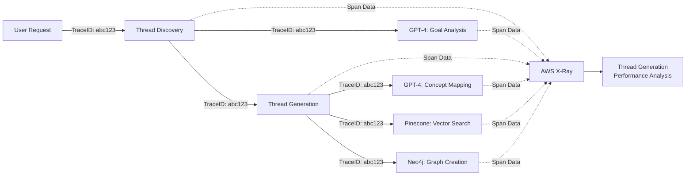

# Spool System Architecture - Thread-Based Learning Platform on Supabase

**Version:** 3.0  
**Date:** January 2025  
**Status:** Supabase Migration Architecture

## 1. Executive Summary

Spool has evolved from a personalized content delivery system to a revolutionary Thread-based learning platform where students follow their curiosity across all subjects. This document describes the complete migration from AWS infrastructure to Supabase, leveraging Edge Functions for serverless compute and Supabase's integrated PostgreSQL database for all data management needs.

## 2. Architecture Evolution

### 2.1 Migration from AWS to Supabase

| Component | AWS Implementation | Supabase Implementation |
|-----------|-------------------|------------------------|
| **Learning Model** | Thread-based cross-curricular journeys | Same - Thread-based cross-curricular journeys |
| **Database** | AWS RDS PostgreSQL | Supabase PostgreSQL with RLS |
| **Compute** | Lambda Functions & ECS Services | Supabase Edge Functions |
| **Authentication** | AWS Cognito | Supabase Auth |
| **API Gateway** | AWS API Gateway | Edge Function routing |
| **Storage** | S3 Buckets | Supabase Storage |
| **Realtime** | Custom WebSockets | Supabase Realtime |
| **External Services** | Pinecone + Neo4j | Pinecone + Neo4j (unchanged) |

## 3. Thread-Based Architecture Overview

```mermaid
graph TB
    subgraph "Frontend Layer"
        A[React + TypeScript<br/>Thread Visualization] --> B[Vercel/Netlify<br/>Hosting]
        B --> C[Supabase Auth<br/>Authentication]
    end
    
    subgraph "Edge Function Layer"
        C --> D[Supabase Edge Functions<br/>Global Edge Network]
        D --> E[JWT<br/>Validation]
    end
    
    subgraph "Thread Services - Edge Functions"
        E --> TD[Thread Discovery<br/>Edge Function]
        E --> TG[Thread Generation<br/>Edge Function]
        E --> TV[Thread Visualization<br/>Edge Function]
        E --> TC[Thread Community<br/>Edge Function]
    end
    
    subgraph "Core Services - Edge Functions"
        E --> F[Text Interview<br/>Edge Function<br/>(Chat)]
        E --> G[Content Assembly<br/>Edge Function]
        E --> H[Exercise Generation<br/>Edge Function]
        E --> I[Progress Tracking<br/>Edge Function]
    end
    
    subgraph "AI Orchestration"
        TD --> J[LangGraph<br/>Thread Intelligence]
        TG --> J
        F --> J
        G --> J
        H --> J
    end
    
    subgraph "Data Layer"
        J --> K[Supabase PostgreSQL<br/>Thread Management DB]
        J --> L[Neo4j Cloud<br/>neo4j+s://9d61bfe9.databases.neo4j.io]
        J --> M[Pinecone<br/>spool-textbook-embeddings<br/>us-east-1-aws]
        J --> N[Supabase Vault<br/>Secrets Management]
    end
    
    style TD fill:#f96,stroke:#333,stroke-width:4px
    style TG fill:#f96,stroke:#333,stroke-width:4px
    style L fill:#9f9,stroke:#333,stroke-width:4px
    style M fill:#9f9,stroke:#333,stroke-width:4px
    style K fill:#9ff,stroke:#333,stroke-width:4px
```

## 4. Current Infrastructure Status

### 4.1 Active Services

#### Container Services (ECS Cluster: spool-mvp)
| Service | Status | Technology | Purpose |
|---------|--------|------------|---------|
| spool-interview-service | ✅ Active | FastAPI | Text chat interviews |
| spool-content-service | ✅ Active | FastAPI | Content delivery |
| spool-exercise-service | ✅ Active | FastAPI | Exercise generation |
| spool-progress-service | ✅ Active | FastAPI | Analytics tracking |

#### Lambda Functions
| Function | Status | Purpose |
|----------|--------|---------|
| CognitoAutoConfirmUser | ✅ Active | User registration |
| spool-create-thread | ✅ Active | Thread orchestration |
| spool-write-concept | 🆕 Created | Concept personalization |
| pinecone-rds-migration | ✅ Active | Data migration |
| textbook-migration-runner | ✅ Active | Content processing |

### 4.2 Data Infrastructure

#### Vector Database (Pinecone) - LIVE
```yaml
Environment: us-east-1-aws
Index: spool-textbook-embeddings
Status: Active with indexed textbook content
Configuration:
  - Dimensions: 1536 (OpenAI embeddings)
  - Metric: Cosine similarity
  - Content: Full textbook corpus vectorized
```

#### Graph Database (Neo4j) - LIVE
```yaml
URI: neo4j+s://9d61bfe9.databases.neo4j.io
Status: Configured and accessible
Purpose: Thread relationships and prerequisites
Schema: Ready for Thread graphs
```

#### Relational Database (RDS PostgreSQL) - LIVE
```yaml
Instance: database-1
Class: db.t4g.micro (20GB)
Status: Active
Purpose: User profiles, progress, configuration
```

## 5. Thread Generation Architecture

### 5.1 Thread Discovery Service (TO BUILD)

```python
# Service Architecture
class ThreadDiscoveryService:
    """
    Extracts learning goals from conversational interviews
    """
    
    async def analyze_conversation(self, transcript: str) -> LearningGoal:
        # Use GPT-4 to extract structured learning objectives
        objectives = await self.llm.extract_objectives(transcript)
        scope = await self.llm.determine_scope(transcript)
        return LearningGoal(objectives, scope)
    
    async def propose_thread(self, goal: LearningGoal) -> ThreadProposal:
        # Generate initial Thread structure
        concepts = await self.identify_concepts(goal)
        return ThreadProposal(goal, concepts)
```

**Integration Points:**
- Receives conversation history from Text Interview Service
- Sends proposals to Thread Generation Service
- Stores goals in PostgreSQL

### 5.2 Thread Generation Service (TO BUILD)

```python
class ThreadGenerationService:
    """
    Maps concepts across subjects and assembles Threads
    """
    
    async def generate_thread(self, goal: str, context: UserContext):
        # Step 1: Cross-curricular concept mapping
        concepts = await self.llm.map_concepts_across_subjects(
            goal,
            subjects=["Math", "Science", "Literature", "History", 
                     "Art", "Business", "Technology", "Life Skills"]
        )
        
        # Step 2: Generate embeddings
        embeddings = await self.generate_embeddings(concepts)
        
        # Step 3: Vector search with 80% threshold
        relevant_content = await self.pinecone.search(
            embeddings,
            threshold=0.80,  # Critical threshold
            max_results_per_concept=5
        )
        
        # Step 4: Build Thread graph in Neo4j
        thread_graph = await self.neo4j.create_thread(
            relevant_content,
            prerequisites_graph,
            goal
        )
        
        # Step 5: Optimize learning sequence
        return self.optimize_sequence(thread_graph)
```

### 5.3 Thread Visualization Service (TO BUILD)

```javascript
// D3.js Thread Visualization
class ThreadVisualizer {
    constructor(threadData) {
        this.nodes = threadData.concepts;
        this.links = threadData.relationships;
        this.subjectColors = {
            'Math': '#FF6B6B',
            'Science': '#4ECDC4',
            'Literature': '#45B7D1',
            'History': '#F9CA24',
            'Art': '#A29BFE',
            'Technology': '#74B9FF',
            'Business': '#81C784',
            'Life Skills': '#FFB142'
        };
    }
    
    render() {
        // Interactive force-directed graph
        // Color-coded by subject origin
        // Progress indicators on nodes
        // Branching paths for exploration
    }
}
```

## 6. Data Flow Architecture

### 6.1 Thread Creation Flow



### 6.2 Content Delivery with Thread Context



## 7. Enhanced Service Specifications

### 7.1 Text Interview Service Enhancement

**Current Capabilities:**
- Text-based chat interface
- Real-time message processing
- Interest extraction

**Thread-Based Enhancements:**
```python
# New conversation prompts for Thread discovery
THREAD_DISCOVERY_PROMPTS = [
    "What's something you've been really curious about lately?",
    "Is there something you've always wanted to learn how to do?",
    "What would you like to be able to do once you understand this?",
    "How deep do you want to go with this topic?",
    "Are there specific aspects you're most curious about?"
]

# Integration with Thread Discovery Service
async def complete_interview(transcript: str):
    # Extract both interests AND learning goals
    interests = await extract_interests(transcript)
    learning_goal = await extract_learning_goal(transcript)
    
    # Send to Thread Discovery Service
    thread_proposal = await thread_discovery.propose_thread(
        learning_goal, 
        interests
    )
    
    return {
        "interests": interests,
        "thread_proposal": thread_proposal
    }
```

### 7.2 Content Service Thread Integration

**Current:** Delivers personalized content based on interests
**Enhancement:** Thread-aware content delivery

```python
async def get_concept_content(concept_id: str, thread_id: str):
    # Get Thread context from Neo4j
    thread_context = await neo4j.get_thread_context(thread_id)
    
    # Generate Thread-specific bridges
    bridge_content = await generate_bridge_explanation(
        concept_id,
        thread_context.goal,
        thread_context.previous_concepts
    )
    
    # Enhance standard content with Thread relevance
    content = await get_base_content(concept_id)
    content.thread_bridge = bridge_content
    content.relevance_score = thread_context.relevance_scores[concept_id]
    
    return content
```

### 7.3 Exercise Service Thread Context

```python
async def generate_thread_exercise(concept_id: str, thread_id: str):
    thread = await get_thread_context(thread_id)
    
    # Generate exercise that relates to Thread goal
    exercise_prompt = f"""
    Create an exercise for {concept_id} that:
    1. Tests understanding of the concept
    2. Relates to the Thread goal: {thread.goal}
    3. Uses context from: {thread.domain}
    4. Incorporates student interests: {student.interests}
    """
    
    exercise = await llm.generate_exercise(exercise_prompt)
    return exercise
```

## 8. Infrastructure Requirements

### 8.1 New Services Deployment Plan

| Service | Container | Resources | Dependencies |
|---------|-----------|-----------|--------------|
| Thread Discovery | ECS Fargate | 1 vCPU, 2GB RAM | GPT-4 API |
| Thread Generation | ECS Fargate | 2 vCPU, 4GB RAM | Pinecone, Neo4j, GPT-4 |
| Thread Visualization | ECS Fargate | 1 vCPU, 2GB RAM | Neo4j, D3.js |
| Thread Collaboration | ECS Fargate | 1 vCPU, 2GB RAM | PostgreSQL, Redis |

### 8.2 Database Schema Updates

#### PostgreSQL - Thread Tables
```sql
-- Thread management
CREATE TABLE threads (
    id UUID PRIMARY KEY,
    user_id UUID REFERENCES users(id),
    goal TEXT NOT NULL,
    status VARCHAR(50),
    created_at TIMESTAMP,
    updated_at TIMESTAMP
);

CREATE TABLE thread_concepts (
    thread_id UUID REFERENCES threads(id),
    concept_id VARCHAR(255),
    relevance_score DECIMAL(3,2),
    sequence_order INTEGER,
    status VARCHAR(50),
    PRIMARY KEY (thread_id, concept_id)
);

CREATE TABLE thread_progress (
    user_id UUID REFERENCES users(id),
    thread_id UUID REFERENCES threads(id),
    current_concept_id VARCHAR(255),
    completed_concepts JSONB,
    last_activity TIMESTAMP,
    PRIMARY KEY (user_id, thread_id)
);
```

#### Neo4j - Thread Graph Model
```cypher
// Thread nodes and relationships
CREATE (t:Thread {
    id: $threadId,
    goal: $goal,
    userId: $userId,
    created: timestamp()
})

CREATE (c:Concept {
    id: $conceptId,
    name: $name,
    subject: $subject,
    difficulty: $difficulty
})

// Thread contains concepts with relevance
CREATE (t)-[:CONTAINS {
    sequence: $order,
    relevance: $score,
    status: 'pending'
}]->(c)

// Cross-curricular bridges
CREATE (c1)-[:BRIDGES_TO {
    reason: $bridgeExplanation,
    strength: $connectionStrength
}]->(c2)

// Prerequisites across subjects
CREATE (c1)-[:PREREQUISITE_FOR]->(c2)
```

## 9. API Endpoints

### 9.1 Current Endpoints (Active)
```yaml
Base URL: https://alj6xppcj6.execute-api.us-east-1.amazonaws.com/prod/

/api/interview/*    # Text chat interview endpoints
/api/content/*      # Content delivery
/api/exercise/*     # Exercise generation
/api/progress/*     # Progress tracking
```

### 9.2 New Thread Endpoints (To Implement)
```yaml
# Thread Discovery
POST   /api/thread/discover      # Analyze learning goal
GET    /api/thread/proposals     # Get Thread proposals

# Thread Generation  
POST   /api/thread/generate      # Create new Thread
GET    /api/thread/{id}          # Get Thread details
PUT    /api/thread/{id}/branch   # Create Thread branch

# Thread Progress
GET    /api/thread/{id}/progress # Get Thread progress
POST   /api/thread/{id}/complete # Mark concept complete

# Thread Community
GET    /api/thread/community     # Browse shared Threads
POST   /api/thread/{id}/share    # Share Thread
POST   /api/thread/{id}/remix    # Create Thread variant
```

## 10. Scaling Architecture

### 10.1 Service Auto-Scaling

```yaml
# Thread Services Scaling Policy
ThreadDiscoveryService:
  MinTasks: 2
  MaxTasks: 10
  TargetCPU: 70%
  ScaleOutCooldown: 60s

ThreadGenerationService:
  MinTasks: 2
  MaxTasks: 20
  TargetCPU: 60%
  TargetMemory: 80%
  
ContentService:
  MinTasks: 2
  MaxTasks: 30
  TargetRequestCount: 100/minute
```

### 10.2 Database Scaling Strategy

**Neo4j Scaling:**
- Causal clustering for read scaling
- Dedicated Thread query instances
- Graph caching for popular Threads

**Pinecone Scaling:**
- Multi-pod deployment
- Namespace per subject for isolation
- Automatic pod scaling based on queries

## 11. Monitoring & Observability

### 11.1 Thread-Specific Metrics

```python
# CloudWatch custom metrics for Thread platform
thread_metrics = {
    # Thread generation
    'thread.generation.time': histogram,
    'thread.generation.concepts_identified': gauge,
    'thread.generation.relevance_average': gauge,
    
    # Cross-curricular effectiveness
    'thread.subjects_per_thread': histogram,
    'thread.bridge_quality_score': gauge,
    
    # User engagement
    'thread.completion_rate': gauge,
    'thread.branch_rate': counter,
    'thread.concepts_per_session': histogram,
    
    # System performance
    'pinecone.relevance_search.latency': histogram,
    'neo4j.thread_query.latency': histogram,
    'llm.concept_mapping.latency': histogram
}
```

### 11.2 Distributed Tracing for Thread Generation



## 12. Security Enhancements

### 12.1 Thread Data Security

```yaml
# Thread-specific security policies
ThreadDataAccess:
  - Users can only access their own Threads
  - Shared Threads require explicit permissions
  - Thread remixing maintains attribution
  - Educator endorsement requires verification

DataEncryption:
  - Thread goals encrypted at rest
  - Student progress encrypted in transit
  - Cross-service communication via TLS 1.3
```

## 13. Migration Strategy

### 13.1 Phase 1: Foundation (Current - 3 months)
- [x] Configure Pinecone with textbook content
- [x] Set up Neo4j cloud instance
- [x] Deploy base microservices
- [ ] Build Thread Discovery Service
- [ ] Build Thread Generation Service
- [ ] Implement 80% relevance threshold

### 13.2 Phase 2: Thread Experience (3-6 months)
- [ ] Thread visualization with D3.js
- [ ] Cross-curricular bridge generation
- [ ] Thread branching and evolution
- [ ] Community Thread library

### 13.3 Phase 3: Scale & Optimize (6-9 months)
- [ ] Thread recommendation engine
- [ ] Real-time Thread adaptation
- [ ] Advanced caching strategies
- [ ] Multi-region deployment

## 14. Cost Optimization

### 14.1 Current Monthly Costs
- ECS Services (4 × 2 tasks): ~$120
- RDS PostgreSQL: ~$15
- Neo4j Cloud: ~$200
- Pinecone: ~$70
- API Gateway: ~$10
- **Total: ~$415/month**

### 14.2 Projected Thread Platform Costs
- Additional ECS Services (4 × 2-10 tasks): +$200-500
- LLM API calls (Thread generation): +$300-800
- Increased Pinecone queries: +$100-300
- Neo4j scaling: +$100-200
- **Projected Total: $1,200-2,500/month**

## 15. Success Criteria

The Thread-based architecture will be considered successful when:

1. **Thread Generation**: < 5 seconds for initial Thread
2. **Relevance Accuracy**: 90%+ of content meets 80% threshold
3. **Cross-Curricular**: Average 4+ subjects per Thread
4. **User Engagement**: 70%+ Thread completion rate
5. **System Performance**: < 200ms API response time
6. **Scalability**: Support 10,000 concurrent users
7. **Availability**: 99.9% uptime SLA

This architecture evolution transforms Spool from a personalized content system into a revolutionary Thread-based learning platform where curiosity truly drives the curriculum.